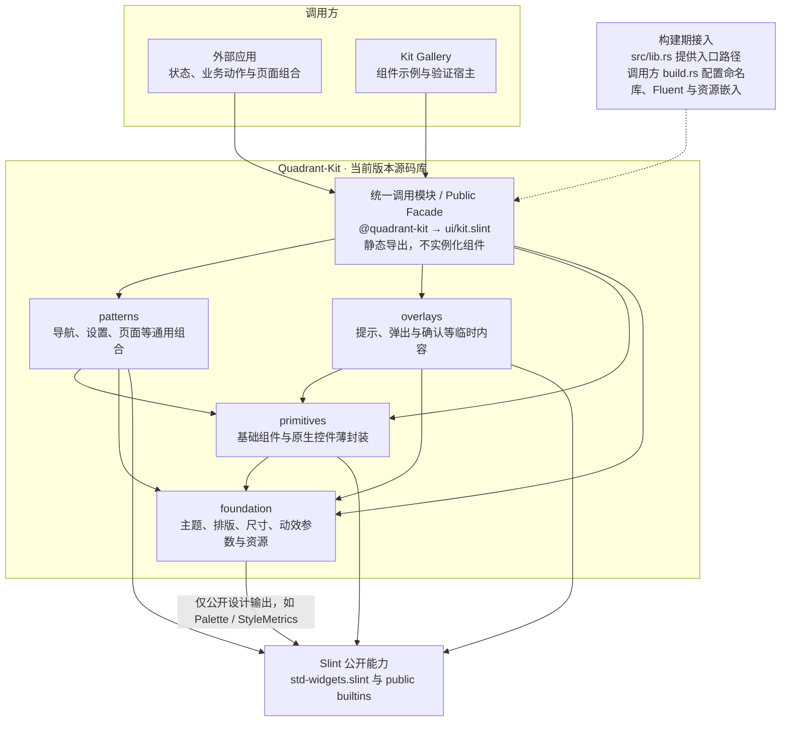

# Quadrant-Kit 原生复用、视觉与轻量化演进 SPEC

> 面向 Codex 的分阶段实施规范 · v1.1 · 2026-09-09  
> 目标仓库：`wadaxiyang/Quadrant-Kit`  
> 审计基线：`737d0aae0975232f520cc1e82640d99e8eb49467`（2026-09-08）  
> 基线工具链：Slint / slint-build `=1.17.1`，Rust MSRV `1.92`，edition `2024`。  
> 本文是实施计划，不是已完成改造报告。v1.0 基于上述 SHA 的关键源码、公共入口、架构/API/验证文档和锁定版本的 Slint 上游源码形成。v1.1 根据用户对模块化与版本策略的澄清修订，不代表重新审计了远程最新 HEAD；未执行本轮改造、Windows 原生性能或读屏验收。
> **本次核心修订：实现与调用解耦；统一静态公共入口；允许接口增删和破坏性变更；当前版本不携带旧实现或兼容层。** 第 3.5 节提供须由 Codex 放入 README 的 Mermaid 架构图。

## 0. Codex 执行入口与工作边界

### 0.1 默认只执行一个阶段

**收到“按这份 SPEC 实施”但没有指定阶段时，只执行 P0；完成后停止。**

- 执行前读取仓库及相关目录中的 `AGENTS.md`，检查 `git status --short`、当前 HEAD 和已有阶段报告。
- 不要求 checkout 到本文审计 SHA，不覆盖用户后来新增的代码。若当前 HEAD 不同，先记录与审计基线的差异，然后按当前源码校正实施清单。
- 不跨越阶段门禁。一个阶段可以拆成多个小提交，但不能把全部阶段合为一次大改。
- 每阶段报告必须区分 `PASS`、`FAIL`、`NOT_RUN`、`BLOCKED`。没有执行过的测试不能写成通过。
- 阶段未满足门禁时，保留可复现证据并停止，不能通过删除测试、放宽指标、更新截图或 API 基线伪造通过。
- 本轮仅修改 Kit、Kit Gallery、同仓验证设施和文档。**不修改 Quadrant-Tasks，不改消费者的依赖 SHA，不推送、不发布、不重打标签。** 发布或跨仓接入必须有另外的明确授权。
- 不升级 Slint、Rust MSRV 或渲染后端，不借视觉改造重新做项目拆分，不重写已经完成的 Gallery 原生窗口标题栏。

### 0.2 本轮目标

建设一个**以 Slint 公开原生组件为行为基础、接近 WinUI 3 默认桌面视觉、通过统一公共入口解耦实现与调用、便于按版本演进且可以证明轻量的源码组件库**。

这里的“Slint 原生”指 Slint 自带的公开 `std-widgets.slint` 控件和公开内建元素，不指把 Microsoft.UI.Xaml 控件嵌入 Slint。

本轮“补全”有明确边界：先补齐通用桌面应用高频控件及现有组件的行为缺口，不承诺把 WinUI 3 的全部控件、全部 API 和平台服务移植过来。未覆盖部分进入组件状态表，不用名字相似的简化实现冒充完整兼容。

### 0.3 三个必须先说明的区别

1. **复用源码/组件，不等于运行时零开销。** 必须分别测编译产物、启动、实例内存、空闲状态和交互开销。
2. **模块化不等于跨版本兼容。** 尽量保持清晰、一致的调用方式，是为了减少开发耦合，不是冻结接口。每个版本可以增删组件、属性和回调；当前版本只维护当前实现，需要旧接口的开发者自行选用旧版本。
3. **尽量接近 WinUI 3，不等于突破 Slint 公开样式接口限制。** 不能为像素一致而重新实现已有输入控件、导入 Slint 私有控件文件，或把一个不可见的原生控件放在手写控件后面充当“合规凭证”。

### 0.4 v1.1 对旧规范的覆盖关系

**本节是用户本次澄清后的执行原则，取代 v1.0 中所有“必须保留旧调用”的要求。**

| 项目 | v1.1 执行规则 | 不再要求的内容 |
|---|---|---|
| 模块化 | 调用方依赖统一公共入口；组件自己负责实现与原生封装；内部依赖遵守分层 | 为每个组件另建一套历史接口适配壳 |
| 接口演进 | 有开发收益时可增删、改名、调整类型/方向/默认值，同步当前调用和文档 | 旧签名永久有效、旧源码不修改即可编译新版本 |
| 版本隔离 | 每个版本只有该版本的实现；旧代码留在 Git 历史与已有版本中 | 新旧实现并存、兼容分支、deprecated 转发别名、双版本运行路径 |
| 验证 | 验证当前版本入口、API、示例、行为、文档的一致性与性能 | 冻结历史消费者，要求旧/新 Kit 都能编译同一份旧调用源码 |
| 新组件接入 | 在所属实现层完成组件，再在 `ui/kit.slint` 静态导出；质量资料同步维护 | 运行时注册、动态工厂、字符串分派或要求每个宿主注册一次组件 |

允许破坏性 API 变更是本轮已经明确的方向，不需要为保留历史调用停工。仍须说明改动理由、影响范围和当前版本的新用法；**不兼容不是随意改接口、删除有效功能或静默改变行为的许可。** 本轮不代替外部开发者改代码，不修改 Tasks，也不改变现有发布授权边界。

原文中的旧版截图、行为复现和性能“改造前基线”仍可用于分析；它们不是必须永久保留的实现或兼容性验收目标。历史报告保留事实及适用 SHA，不能据本次规则改写过去结果。

---

## 1. 基线审计结论

下面的“已确认”来自源码或仓库文档。“风险/推断”不等于已测得的性能或实际截图缺陷。源码索引见第 18 节。

| 编号 | 已确认的基线情况 | 判断及处理 | 证据 |
|---|---|---|---|
| A01 | `ui/kit.slint` 统一导出 35 个名称，其中 21 个视觉组件、6 个 global、7 个 enum、1 个 struct | 沿用公共入口作为静态调用模块；35 个名称仅是审计时状态，不是后续不可增删的集合，不恢复旧版 SidebarItem | R02、R04 |
| A02 | 根 Cargo 包没有 normal/runtime dependency；只给构建脚本提供源码位置 | 这是正确的轻量基础。继续保持源码库与运行时应用隔离，但不能据此宣布 UI 零开销 | R01、R03 |
| A03 | `FluentButton`、`IconButton`、`SegmentButton` 都自行组合 Rectangle、FocusScope、TouchArea 处理按钮交互 | 不符合本轮“已有原生控件必须封装”的要求。优先迁移到公开 Button，而不是继续美化这三套输入实现 | R05–R07 |
| A04 | `FluentTextField` 使用 LineEdit；`FluentTextArea` 使用 TextEdit | 已经走在正确方向上，应保留编辑、IME、选择、剪贴板等原生行为，改善外围布局和错误提示 | R08、R09 |
| A05 | `Motion` 已定义 100/160/200ms；`ToastHost` 已有 height 和 opacity 动画 | “整个 Kit 没有动画”并不准确。应做动画盘点、统一和补缺，不重复叠加 | R10、R11 |
| A06 | Slint 1.17.1 Fluent Button 自带背景/边框/文字的 150ms 动画；公开属性包括 primary、icon、checkable、checked、pressed、has-focus 等 | 原生迁移可以同时修正重复实现与部分生硬感；不要在 wrapper 再重复处理同一状态 | U02 |
| A07 | Slint 1.17.1 Palette 的颜色为 out brush；可设置的公开主题接口是 color-scheme | 不能写入 Palette.accent-background，也不能用它逐按钮换成红色；必须有明确的样式能力/差异清单 | U03 |
| A08 | Theme、Typography、UiConstants、Elevation 已被复用；SurfaceCard 的阴影由 elevated 控制 | 不是完全没有设计系统。保留并整理，避免另造一套平行 token 系统 | R10、R12 |
| A09 | `NavigationBackButton` 复用了 IconButton；NavigationView 复用了文本框、滚动容器、导航内部模块 | 修改基础按钮能向上传递收益，应保留这种组合关系，不把所有高层组件重新摊开手写 | R13、R14 |
| A10 | NavigationView 使用 ScrollView + for；每个导航模型上限 256 项。校验对各项做跨模型 ID 计数及父级查询 | 存在二次复杂度路径及全量行实例化风险；这是静态分析，不是实测“卡”。按 16/64/256 项测试后优化，不擅自扩大模型上限 | R14、R15 |
| A11 | Gallery 页面使用条件 `if` 创建；不是把所有页面都常驻隐藏 | 保留按需实例化。不能把 Gallery 的整机占用归因于单个 Kit 组件 | R16 |
| A12 | Toast 未显示时高度/透明度变为零，但内部布局、关闭按钮及计时器声明仍在组件树中；计时器 running 有显示/悬停条件 | 没有证据证明隐藏状态持续计时，但存在保留子树的优化空间；测量后使用按需创建和受控退场 | R11 |
| A13 | TooltipHost 是一个 `shown` 控制的内联 Rectangle；部分导航组件已使用 Slint Tooltip，而 IconButton 直接跟随 has-hover | 提示服务不统一，内联 z 值不能解决祖先裁剪。统一走原生 Tooltip；TooltipHost 可保留为纯内容呈现器 | R06、R13、R17 |
| A14 | ModalManager 在 capture-key-pressed 中统一拦截 Return/Escape；文档明确未建立完整 Tab 围合和焦点恢复 | 优先解决确认按钮误触/重复触发、Tab 外逃与关闭恢复。不能称其为完整 WinUI ContentDialog | R18、R03、R04 |
| A15 | API/边界扫描器、API JSON、Gallery probe、资源清单、分发和增量构建验证已存在 | 扩展既有验证机制，不另写一套平行语法解析器，不把历史测试报告当作当前结果 | R19、R20 |
| A16 | Gallery 自己承担 Windows DWM 和 macOS AppKit 窗口适配，Kit 不承担平台窗口动作 | 保持此边界，不把平台依赖放进 Kit 根包，不改成手绘系统窗口按钮 | R16、R21 |
| A17 | SettingRow.enabled 当前只影响透明度，没有把任意 @children 的 enabled 自动绑定进去 | “变灰”不等于“禁用”。必须明确 slot 的禁用协议，补真实交互测试，不能用一个透明点击遮罩假装禁用全部键盘/读屏动作 | R22 |

**总判断：架构与源码分发方向正确，原生复用只完成了一部分；视觉/行为一致性和性能验收尚未形成完整闭环。应修正并扩展，而不是重建另一套 UI 框架。**

---

## 2. 不可变设计决策

### 2.1 冲突处理顺序

当要求不能同时满足时，按以下顺序处理：

1. 正确交互、可访问性、数据安全，以及当前版本明确声明的有效功能与行为。
2. 复用 Slint 的公开原生行为；已有行为不再实现第二份。
3. 保持轻量、无不必要后台工作，并满足已审定性能预算。
4. 在上述边界内尽量贴近 WinUI 3 默认视觉与克制动效。

不能通过牺牲前几项换取截图更像。无法兼得时保留可用行为、登记差异并停止该项的“完成”声明，不偷偷替换目标。

### 2.2 必须长期成立

- `@quadrant-kit` / `ui/kit.slint` 是唯一受支持的公共 Slint 入口。
- 根 Rust API 继续只有源码定位职责，不创建窗口，不运行事件循环，不增加 required runtime adapter。
- Theme、Motion 等 global 的共享范围是同一个顶层组件实例的组件树，不是整个进程；每个独立窗口分别初始化。
- Kit 不拥有导航历史、路由、页面缓存、业务存储、Agent、IPC、任务实体或产品品牌。
- 内部实现与调用代码分离；公共类型、方向、回调、方法和默认行为可以随版本调整，但必须定义清楚并同步当前使用点。架构边界尽量稳定，不建立历史接口兼容义务。
- 不导入 Slint 的 `internal/compiler/widgets/...` 文件。本文引用上游文件仅用于审计公开控件的真实能力。
- 不 fork/vendor Slint 标准控件来绕过本轮原生封装约束；上游不足通过差异清单/后续独立升级议题处理。
- 公共入口的“注册”是编译期 `export`，不是运行时服务；不为一个按钮引入线程、异步运行时、运行时全局 registry、动态 JSON 皮肤引擎、反射、组件解析器或后台轮询。
- 保留版权头、GPL 源码来源记录与现有 MIT SVG 授权。**不分发系统字体文件。**

---

## 3. 目标架构与目录责任

### 3.1 分层沿用，不新增一个“万能框架层”

```text
Quadrant-Kit/
├── src/lib.rs                    # 仅构建期源码入口帮助函数
├── ui/
│   ├── AGENTS.md                 # UI 层永久约束
│   ├── kit.slint                 # 统一调用模块 / 唯一 public facade，只做静态导出
│   ├── foundation/
│   │   ├── theme.slint           # 设计语义与 globals；按职责拆分，不保留历史 API 壳
│   │   ├── constants.slint
│   │   ├── fluent_icons.slint
│   │   └── private/              # 确有需要才创建，小型私有语义配方
│   ├── primitives/
│   │   ├── fluent_button.slint   # 原生 Button 封装；内部文件名不成为消费路径
│   │   ├── text_field.slint
│   │   ├── text_area.slint
│   │   ├── ...                   # 新增公开原生控件 wrapper
│   │   └── private/              # 经验证的共享小片段，不成为第二套输入框架
│   ├── patterns/
│   │   ├── navigation/
│   │   ├── settings/
│   │   ├── page/
│   │   ├── window/
│   │   └── ...                   # 仅在新增真实组件时增加分类
│   └── overlays/
│       ├── toast.slint
│       ├── modal.slint
│       └── ...                   # 基于公开 PopupWindow 等能力的短暂交互
├── gallery/
│   ├── AGENTS.md
│   ├── ui/pages/                 # 真实消费公开 API 的示例
│   ├── ui/shared/                # 仅 Gallery 的示例容器、catalog、工具栏
│   └── src/                      # 窗口适配、测试、可选性能运行入口
├── scripts/                      # 复用 slint_contract.py 等已有机制
├── docs/
│   ├── specs/QUADRANT_KIT_FLUENT_EVOLUTION_SPEC.md
│   └── implementation/kit-fluent-v1/
│       ├── STATE.md
│       └── P0.md ... P8.md
└── AGENTS.md
```

**不要为了符合这棵树而在一个提交中批量移动已有文件。** 目录树说明职责，不要求先进行无收益的文件搬迁。拆分 `theme.slint` 前先证明不会创建重复 global、循环依赖或失效绑定；涉及公开 API 时同步当前版本快照和使用点，不为旧默认表达式保留转接层。

### 3.2 各层放什么

| 层 | 应放内容 | 不应放内容 | 复用方式 |
|---|---|---|---|
| foundation | 颜色语义、尺寸、排版、动效策略、层级/阴影参数、通用图标资源 | Button 实例、TouchArea、计时器、窗口、导航模型、业务状态 | 属性/global/纯配方共享，不生成可视树 |
| primitives | 一个基础功能的控件，公开 std 控件的薄封装；FluentIcon、Badge、SurfaceCard 等被允许的基础呈现组件 | 路由、整页布局、产品逻辑、通用输入状态机框架 | 原生行为 + 少量公开映射/装饰 |
| patterns | NavigationView、SettingRow、PageHeader 等通用组合与布局协议 | 页面创建/缓存、数据库、窗口平台调用 | 优先组合 Kit primitives，必要时直接使用公开 std 结构能力 |
| overlays | Toast、确认层、Flyout 等临时内容的可见性与关闭请求、局部焦点协调 | 通知中心、全局弹窗业务队列、窗口管理器、常驻守护服务 | 复用 primitives；弹出/定位/关闭优先用公开 Slint builtin |
| facade / 统一调用模块 | 当前版本公开组件、global、enum、struct 的明确静态导出 | 实例、状态、运行时注册、行为、业务条件 | 隐藏实现路径；新增组件在这里导出后可被调用 |
| Gallery / 外部 host | 系统主题输入、系统减少动画偏好、窗口生命周期、平台标题栏、数据和导航历史 | 私下导入 Kit 内部文件、复制 Kit 实现 | 只消费公开 API |

### 3.3 导入方向

箭头表示“左边依赖右边”：

```text
Gallery / 外部消费者 → facade
facade → foundation / primitives / patterns / overlays
primitives → foundation
patterns → primitives / foundation
 overlays → primitives / foundation
```

- 同层允许小型内部依赖，但必须无环。
- patterns 与 overlays 保持互不导入，沿用当前边界；需要共同能力时下沉最小可复用部分，而不是放开所有跨层依赖。
- 实现层不得通过 `kit.slint` 反向导入自己。
- `std-widgets.slint` 是合法公开外部依赖。foundation 只能读取 Palette/StyleMetrics 等无 UI 实例的公开设计输出，不能在 foundation 放原生按钮实例。
- `TooltipHost` **暂保留为 primitive 级纯呈现器**。真正的提示生命周期使用原生 `Tooltip`。这样 NavigationView/按钮可使用 tooltip 而不引入 patterns ↔ overlays 依赖环。
- 物理目录不等于运行时常驻对象。`overlays/` 不能因此产生自动启动的全局 overlay manager。

### 3.4 “调用模块”是独立入口，不是独立运行时

本项目采用三个清楚的职责边界，而不是三套运行时对象：

| 边界 | 代码位置 | 负责什么 | 如何变化 |
|---|---|---|---|
| 调用方 | Gallery 或应用自己的 `.slint` / host 代码 | 提供输入、绑定状态、处理输出和业务动作、决定在哪里使用组件 | 仅使用当前公开 API；API 有变更时按该版本文档修改调用 |
| 统一调用模块 | `ui/kit.slint`，由构建脚本映射为 `@quadrant-kit` | 声明当前版本向外提供哪些名称及对应的实现模块 | 增加/删除静态导出；实现搬迁时调整映射；不转发业务事件 |
| 组件实现 | `foundation/`、`primitives/`、`patterns/`、`overlays/` | 定义当前接口并实现布局、原生封装、视觉与必要交互 | 修改内部代码，或有理由地演进公开接口；不携带历史实现 |

**当前 `ui/kit.slint` 已经具备所需入口的雏形，应完善它，而不是另建 `KitManager`、组件工厂或“调用服务”。** 公共组件的属性/回调声明可以与实现放在同一 `.slint` 文件中；本轮不要求为每个控件复制一份 `interface.slint` 和 `implementation.slint`，也不要求 facade 再实例化一层透明 wrapper。

调用方依赖的是组件的当前公开语义，不依赖它在内部用了几层 Rectangle、位于哪个私有子目录或如何组合原生控件。Facade 负责**名称与模块的可见性**，不自动适配旧属性、转换旧回调或隐藏已经发生的 API 变更。

内部组件之间仍沿第 3.3 节直接依赖实现模块或下层辅助件，不绕回公共入口。因此更换实现路径只需更新 facade 与实际受影响的内部 import，不要求所有业务页面知道该路径。公开签名改变时，当前调用代码也可以改变；这是正常版本演进，不是模块化失败。

### 3.5 Kit 架构图（P1 放入 README）

**以下 Mermaid 代码块及其说明是 README 的交付内容，不是仅供参考的附录。** P1 将它放在 README 项目定位之后、详细使用指南之前，标题建议为“架构与组件接入”。图展示目标依赖关系，不表示所有待补全组件已经完成。

实线箭头表示“导入/依赖”，虚线表示构建期配置。它不是事件流、消息总线或运行时注册流程图。



图后须在 README 紧接写明：

> 应用与 Gallery 通过 `@quadrant-kit` 使用当前版本组件。新增组件在所属实现层完成后，由 `ui/kit.slint` 静态导出，即可从统一入口导入使用；Gallery 的 catalog 仅负责展示与搜索，不参与 Kit 运行。内部实现不依赖调用方，patterns 与 overlays 不互相导入。API 可以随版本增删或调整，当前版本不提供旧实现与兼容层，需要旧接口时自行选择旧版本。

P1 核对图与 `ARCHITECTURE.md`、边界检查器一致；P8 再核对最终代码与 README。保留可编辑的 `mermaid` fenced code，不用截图代替图源码。能验证 Markdown 渲染时记录结果；未验证渲染时标明，不能因此声称代码实现已经完成。

### 3.6 新组件如何“注册”并被使用

以 P4A 计划新增的 `FluentCheckBox` 为例。下面的实现路径是建议路径，不是声明文件已存在；实施时按实际路径更新。

**第一步，在实现层完成当前组件。** 例如 `ui/primitives/check_box.slint` 内定义并导出 `FluentCheckBox`，行为来自公开原生 CheckBox，不在 facade 中编写它的实现。

**第二步，在唯一调用模块声明公开导出。**

```slint
// ui/kit.slint 中增加一条静态导出；不是运行时 register()。
export { FluentCheckBox } from "primitives/check_box.slint";
```

**第三步，调用方从统一入口导入并在需要的位置实例化。**

```slint
import { FluentCheckBox } from "@quadrant-kit";

export component CheckBoxExample inherits Window {
    preferred-width: 320px;
    preferred-height: 80px;
    VerticalLayout {
        // 输入和回调按当前版本 PUBLIC_API.md 配置。
        FluentCheckBox { }
    }
}
```

对于已经接入 Kit 的应用，新增公开组件不要求新增 Rust 注册回调、修改宿主启动流程或维护一个组件名称字符串表。尚未接入 Kit 的应用仍按 CONSUMER_GUIDE 完成一次正常的构建期命名库配置。

**“只需注册即可调用”指不必改造公共入口机制或无关组件，不等于只写一条 export 就完成实现和验收，也不等于组件会自动出现在业务页面。** 新功能最终需要调用方在合适位置使用；给已有组件新增属性/回调，一般只需更新该组件声明与实现，不重复注册同一个组件名称。新增独立公开类型时才补充相应类型导出。

开发交付仍同步当前 API 文档与快照、编译 probe、原生复用清单、组件状态和 Gallery 示例。**Gallery catalog 是演示登记，facade 是库公开入口，native manifest 是开发期检查资料，三者不得混成运行时注册中心。** 不另设一份重复维护的 JSON 组件导出表；facade 作为公开名称集合的唯一代码事实来源。

---

## 4. 原生复用策略与不能绕过的能力边界

### 4.1 必须先生成可核验映射表

在 P0/P2 对锁定的 Slint 1.17.1 逐项核验：

- 对应控件是否来自公开 `std-widgets.slint`，或是公开 builtin。
- 可用 property 的方向/类型/默认值、callback、focus 方法、模型结构。
- 是否已有 hover/pressed/focus/disabled、键盘激活、滚动、编辑、动画。
- 样式是否可通过公开 API 修改；不能拿内部 `FluentPalette` 的可见源码当成受支持 API。
- wrapper 引入多少附加声明节点；哪些是按需实例化，哪些一直存在。
- 是否存在 WinUI 能力差异；差异是上游限制、未实现，还是本轮明确排除。

每个当前公开视觉组件必须有记录；已删除/合并组件从当前导出与状态表的有效集合中移除，并记录去向。原生不提供对应完整组件的例外必须列出“缺少的具体能力”，不能只写“为了更漂亮”。

### 4.2 四类实现

| 类型 | 例子 | 允许做法 | 不允许做法 |
|---|---|---|---|
| 标准控件 wrapper | Button、LineEdit、Switch、CheckBox、Slider | 输入输出映射、布局、公开属性配置、必要非交互装饰 | 再加一套点击/拖动/编辑状态机 |
| builtin wrapper / presenter | Tooltip、PopupWindow、ContextMenuArea | 使用系统提供的显示、定位、菜单、tooltip 机制，组合内容 | 仅使用屏幕坐标 + z 值假造弹出层；用定时轮询跟踪鼠标 |
| 复合组件 | SettingRow、NavigationView、Expander、SplitButton | 组合现有控件；只实现该复合结构特有的状态 | 把整个复合组件标为例外后连内部文本框、开关也手写 |
| 无原生对应的呈现/结构例外 | Badge、SurfaceCard、InfoBar、Toast、确认层 | Rectangle/Text/Image 等构图；登记必要输入逻辑的范围 | 把“外观不一样”当成原生组件不存在 |

### 4.3 按钮族的具体处理

1. `FluentButton` 内部必须有一个**可见且真实拥有交互的原生 Button**。采用组合还是可行的直接继承，由公开能力、接口清晰度与实例开销决定，不为旧 `Rectangle` 基类单独保留一层。
2. `IconButton`、`SegmentButton`、导航按钮和 WindowControlButton 的命令行为复用同一原生 Button 路线。按实际公共能力做可编译探针，不能假设继承自动暴露所需样式。
3. 删除被替代的手写输入实现，不在新组件中保留 `legacy` 分支、旧组件实例或新旧实现开关。尚未轮到迁移的其他组件仍只有自身一套当前实现，不为分阶段实施复制第二份。
4. 不再同时保留原来的点击 TouchArea、按键 FocusScope、accessibility default action 与原生 Button 的同等行为。
5. `clicked` 只来自唯一的实际动作路径；不能 native.clicked 触发后再由 wrapper.key-pressed 触发一次。
6. 图标优先传给原生 `icon`/`icon-size`/`colorize-icon`。是否保留 `show_icon` 等重复输入，按当前 API 的必要性决定；允许删除并同步 Gallery，而不是保留空参数。
7. `SegmentButton` 本轮默认继续采用受控选择协议，这是状态所有权决策，不是兼容义务。不能一边宣称由 host 控制，一边让内部独立 checked 状态自行翻转。确有必要改变方向或回调时，作为当前版本 API 变更完整更新文档、使用点和测试。
8. `primary/accent/danger` 可保留、合并或改为更清晰的参数/枚举，前提是原生路线能够真实实现、语义不歧义且不凭空减少必要功能。无需为旧参数组合保留别名或转接分支；新增枚举只定义可落实的状态，不机械复制 WinUI API。
9. 本阶段相关签名变更与必要的同仓调用更新一起交付，并记录对外升级注意事项；不因为旧调用不再编译而保留旧实现，也不修改未授权的外部项目。

### 4.4 danger、accent 与 preview 的真实限制

Slint 1.17.1 Button 没有公开的逐实例红色 danger 模板接口；Palette 颜色为只读。其内部 hover 状态也不等于可写的公开 preview 输入。处理规则如下：

- 普通/primary/icon 路线先做到原生完整可用。
- 危险操作仍需清晰、可区分的危险语义。允许在**不遮蔽原生按钮、不重复绘制整套按钮**的前提下加入轻量红色边界/说明等非交互装饰；旧 `danger` 参数的具体形式不强制保留。
- 不允许通过修改共享 Palette 实现“这一颗按钮变红”；这既不符合公开方向，也可能影响整个窗口。
- native-only 路线不能实现某项旧外观时，在 `NATIVE_REUSE.md` 说明本版本选择的替代与限制。可以调整或删除不合适的接口；不能保留同名无效参数、虚假承诺或整套旧视觉实现。
- **迁移对应组件时移除生产 API 中仅用于截图的 `preview_hover/preview_pressed/preview_focus` 等输入。** Gallery 改用真实/测试驱动输入；静态参考样例放在 Gallery 自己的非生产示意中。不得为这些参数新建兼容 presenter、deprecated alias 或旧实现分支。
- 真实 hover/pressed/focus 验收以原生输入驱动为准。新组件不增加仅为演示强制状态的公开属性。
- 原生能力与旧 API 不吻合时，先重新设计当前版本 API 并更新同仓调用，不按旧合约阻塞迁移。只有无法在公开 Slint 能力内满足本轮必要功能或安全/交互要求时，才将该项标为 `BLOCKED_NATIVE_CAPABILITY` 并停止该路线；不能通过隐藏代理、私有 import 或手写标准输入绕过约束。

### 4.5 例外登记

新增 `scripts/native_reuse_manifest.json`，仅用于开发/CI，不在运行时加载。每条至少包括：

```json
{
  "schema_version": 1,
  "component": "NavigationView",
  "classification": "composed-missing-standard-control",
  "implementation": "ui/patterns/navigation/navigation_view.slint",
  "native_dependencies": ["ScrollView", "Button", "LineEdit"],
  "missing_capability": "No public std NavigationView equivalent in Slint 1.17.1",
  "permitted_custom_behavior": ["hierarchy projection", "controlled expansion requests", "navigation-specific keyboard traversal"],
  "forbidden_custom_behavior": ["text editing", "scrollbar implementation", "ordinary button activation"],
  "validation": ["navigation-behavior", "navigation-256-items"],
  "review_on_slint_upgrade": true
}
```

这是单条记录结构示例，不表示现有 NavigationView 已经满足其中所有要求。最终文件使用统一 records 数组，逐项填入真实状态。

---

## 5. 现有 21 个视觉组件的处理清单

| 现有组件（审计名称） | 本轮公共责任 | 本轮处理重点 |
|---|---|---|
| FluentButton | 文本/图标命令与 clicked | 原生 Button 迁移；disabled、focus、危险语义；清理冗余/preview API，不保留旧实现 |
| IconButton | 图标命令与 tooltip | 原生按钮；正确 accessible name；原生 Tooltip；去除重复输入层 |
| SegmentButton | 受控选择外观与 clicked 请求 | 原生按钮行为；不自有第二份 selected；键盘/读屏选择语义 |
| FluentTextField | text 双向绑定、accepted/edited、错误信息 | 保留 LineEdit；错误文案换行、窄宽度、焦点/禁用、IME |
| FluentTextArea | 多行 text 与 edited | 保留 TextEdit；滚动/换行/选择/剪贴板；不写第二个编辑器 |
| FluentIcon | 图像呈现和着色 | 复用 Image；避免运行时图标扫描与重复资源包；校正尺寸一致性 |
| TooltipHost | 提示内容呈现，不拥有提示服务 | 按当前需求整理 presenter API；实际 tooltip 服务交给原生 Tooltip |
| SurfaceCard | 静态/交互卡片容器 | 默认无阴影；不交互时减少输入辅助对象；任意子内容交互例外必须明示 |
| Badge | 紧凑语义标记 | 统一文字/圆角/语义色；不要加入无意义动画或输入对象 |
| SettingRow | 标题、说明、子内容布局 | 窄布局与长文案；明确 enabled 与任意 @children 的关系 |
| NavigationView | 受控主/页脚导航结构、请求事件 | 保留非路由边界；键盘遍历、焦点恢复、模型更新、有限规模性能 |
| NavigationBackButton | 返回请求，不拥有历史 | 复用 IconButton；保留 accessible_name 与尺寸行为 |
| NavigationPaneToggleButton | 折叠请求，不拥有页面 | 同上；图标变化克制，保持受控 pane_mode |
| NavigationContentSurface | 内容容器与 @children | 保留 none/fluent 等模式；不增加隐式路由、窗口或阴影 |
| WindowControlButton | 通用窗口动作按钮的呈现/回调 | 行为复用原生 Button；不调用 Win32/AppKit，不替代 Gallery 真实系统按钮 |
| SectionHeader | 局部标题布局 | 使用既有排版；长文本/高 DPI，不做进入动画 |
| PageHeader | 标题、说明、动作组合 | 复用按钮；动作布局响应式；不要为了截图复制按钮实现 |
| EmptyState | 空状态图文/动作布局 | 少节点、长文案可读；不默认播放循环动画 |
| MetricCard | 通用数字/说明卡片 | 复用 SurfaceCard；不实现业务计算、不强制数字滚动特效 |
| ToastHost | 一条短暂消息与 dismiss 请求 | 去除不必要高度动画；隐藏实例/计时器边界；一次性关闭请求 |
| ModalManager | 受控的单个确认层 | 整理当前输入/请求 API；修复键盘冲突；建立有限且真实的焦点合约 |

对本表尚未逐行审计的内部实现，P0 补足检查和证据，不把本表中的“处理重点”写成已发现的具体 bug。表内名称用于定位审计对象；允许为清晰职责调整名称/参数，前提是当前版本实现、入口与使用点同步，不为旧名保留别名。

---

## 6. 组件补全范围

### 6.1 本轮必做的原生封装组

名称为本轮建议的公开命名；P1 确定当前阶段采用的方案。**新增组件默认使用 Fluent 前缀；既有名称有必要时可以调整，但不为追求表面整齐批量改名，也不维护旧名别名。** 后续调整同样遵循当前版本 API 同步规则。

| 分组 | 建议新增组件 | 必须复用的 Slint 1.17.1 公开能力 | 能力边界 |
|---|---|---|---|
| 选择 | FluentCheckBox | CheckBox | 三态等能力先核验，不凭 WinUI 名称假设已有 |
| 选择 | FluentSwitch | Switch | text/checked/disabled 等按原生真实合约映射 |
| 选择 | FluentRadioGroup | RadioGroup | 不假设 std 导出了独立 RadioButton；优先整体单选组 |
| 选择 | FluentComboBox | ComboBox | 普通列表选择；不冒充可搜索 AutoSuggestBox |
| 数值 | FluentSlider | Slider | 值、方向、步长/范围采用实际支持能力；不手写拖动 |
| 数值 | FluentSpinBox | SpinBox | 上游是 int 数值；不能宣称完整浮点/表达式 WinUI NumberBox |
| 反馈 | FluentProgressBar | ProgressIndicator | 确定/不确定进度按公开能力；运行状态必须可停 |
| 反馈 | FluentProgressRing | Spinner | 外观接近进度环，不声称 WinUI API 等价；隐藏不能持续额外工作 |
| 容器 | FluentScrollView | ScrollView | 保留 viewport、scrollbar policy、焦点与滚轮；不复制原生滚动条 |
| 列表 | FluentListView | ListView | 保持原生虚拟化可识别的结构；@children 用法必须编译与大列表验证 |
| 列表 | FluentStandardListView | StandardListView | 标准模型、选择及事件；不冒充任意复杂 ListViewItem 模板体系 |
| 分组 | FluentGroupBox | GroupBox | 标题与内容容器；不要与纯呈现 SurfaceCard 合并成万能 Card |
| 标签 | FluentTabWidget | TabWidget | 固定/标准 tab；不冒充带拖拽重排、关闭、多窗口的 WinUI TabView |
| 表格 | FluentStandardTableView | StandardTableView | 原生行/列/排序请求；不是完整 DataGrid，不承诺单元格编辑/冻结列 |
| 日期 | FluentDatePicker | DatePickerPopup + 原生命令/显示控件 | 日期类型、有效范围、确认取消按上游能力；不重写日历算法 |
| 时间 | FluentTimePicker | TimePickerPopup + 原生命令/显示控件 | 时间选择，不混入时区转换或业务格式解析 |

布局型 `HorizontalBox/VerticalBox/GridBox` 没有额外契约需求时允许消费者直接使用 std，不为增加组件数量而制造空 wrapper。日期/时间的公开数据类型需在编译 probe 中验证导出/转换；不假定现有 API scanner 已理解上游重导出。

### 6.2 本轮通用组合与浮层组

| 组件/能力 | 实施方式 | 必须完成的边界 |
|---|---|---|
| Tooltip 一致服务 | 现有 TooltipHost + 公开 Tooltip | 延迟、显示位置、边界/裁剪、键盘可发现性；实际能力不足写明 |
| FluentFlyout | PopupWindow + 已有 primitives | 定位、关闭、重新打开和焦点协议；优先原生 dismiss 语义 |
| 菜单使用模式 | Menu / ContextMenuArea 的公开组合示例 | 先证明可封装/数据绑定结构；不能把任意菜单 API 硬塞进普通 Rectangle |
| FluentDropDownButton / FluentSplitButton | 原生 Button + Flyout/菜单 | 两个点击区的职责清楚；键盘、disabled、关闭都可测试 |
| FluentExpander | 原生 Button + 受控展开内容 | 展开状态由调用者控制；折叠不保留昂贵活跃子树 |
| FluentInfoBar | 通用提示呈现 + 原生关闭按钮 | 与 Toast 区别明确：页内、默认不自动消失 |
| ModalManager 行为补足 | 现有确认层 + 原生按钮 + 有限焦点协调 | 先保证固定确认层，不直接发布“任意内容的完整 ContentDialog” |

将这一组拆成独立小阶段，不能在一次提交里同时做弹窗、菜单、导航和模态栈。

### 6.3 明确不属于本轮“完成”的内容

以下进入 `COMPONENT_STATUS.md` backlog：通用大规模 TreeView、任意内容完整 ContentDialog、富文本编辑器、完整 DataGrid、CalendarView、多窗口可拖拽 TabView、WebView、媒体播放、地图、自动搜索服务、系统通知中心、Mica/Acrylic 材质引擎、Lottie/粒子特效。

排除原因按条写清“上游无对应”“需要新的平台/runtime 边界”“超出本轮常用组件范围”，不是宣称这些组件永远不能做。未来新增仍需遵守原生行为优先与性能门禁。

---

## 7. 模块化调用、当前版本 API 与版本独立演进

### 7.1 核心目标是隔离实现细节，不是保留历史签名

**调用方只通过 `@quadrant-kit` 使用公开组件；组件实现负责原生封装、视觉与必要交互。两者以当前版本明确定义的属性、回调、方法和插槽连接。**

尽量保持合理的名称与调用习惯，可以减少无意义修改；但接口不是永久冻结对象。有实际收益时，允许新增或删除组件/属性，合并参数，修改名称、类型、方向、回调、默认值或公共基类。更换实现方案不需要先证明兼容全部旧用例。

Facade 不等于适配器。内部换文件或布局不应泄漏成新的业务依赖；公开接口变化则正常反映到该版本的调用方式，不能承诺“经过同一个入口就自动兼容”。

| 变化类型 | 当前版本如何处理 | 调用方及验收要求 |
|---|---|---|
| 私有布局、颜色实现、原生内部组合 | 在实现模块内修改，保持职责与依赖方向 | 验证本版公开语义仍有效；不为了重构强迫应用导入私有模块 |
| 内部文件搬迁 | 更新 facade 的导出目标和真实内部依赖 | 外部仍从统一入口导入，不引用新私有路径 |
| 新增公开组件/类型 | 完成实现，在 facade 静态导出 | 当前 probe 与示例覆盖新能力；旧页面无需注册新组件才能启动 |
| 给已有组件新增功能 | 在该组件当前 API 中增加必要输入/输出 | 需要功能的调用方按新文档使用，不重复注册同一组件 |
| 删除/改名/合并参数或组件 | 修改唯一当前实现、静态导出与文档，清理被替代代码 | 更新当前同仓使用点，记录 Breaking changes；不提供旧签名转发 |
| 改变类型、方向、默认行为或公共基类 | 先定义新的清晰语义，再同步实现和验证 | 测试新语义、状态所有权、焦点/布局；不以旧用例编译为硬门禁 |

### 7.2 每个版本只有一套实现

- 当前版本源码只维护当前组件及其当前接口。替换完成后删除旧实现，不保留 v1/v2 双份组件、`legacy_mode`、版本分派、兼容 adapter 或弃用别名。
- 不建立“旧版本 × 新版本”的消费者兼容矩阵，不生成冻结历史接口的测试工程，不将“旧源码原样编译新 Kit”列为验收条件。
- 旧版本保留在正常的 Git 历史和已有发布引用中。需要旧实现的开发者自行选择旧版本；不为此改写旧提交、覆盖标签或额外复制历史源码到新版本包内。
- 外部应用选择升级时，由其开发者按本版本文档更新依赖和必要调用。Kit 不自动修改外部项目，本轮不修改 Tasks 或它的依赖 SHA。
- 当前版本升级说明列出 API 的新增、删除、改名与行为变化，必要时给简短新用法。说明不是兼容层，也不要求维护覆盖所有历史版本的自动迁移工具。
- 本轮分阶段实施中，尚未迁移的控件仍是各自唯一的当前实现；已迁移控件不继续携带旧分支。阶段前后截图/性能数据可以比较，但不把旧实现带入生产包。
- 版本名称与源码 revision 必须明确。**同仓 Gallery、probe、API 文档与源码必须针对同一个当前版本。** 不虚构发布完成，也不自动改变现有版本号/标签；发布动作仍按单独授权执行。

### 7.3 API 快照检查“当前一致性”，不检查“向后兼容”

保留既有 scanner 和 API JSON 的价值，但更改其治理目的：**防止未说明的接口漂移、文档过期、漏导出和测试漏接入，而不是锁死历史 API。**

现有 `scripts/kit_api_v1.json` 可以继续作为当前版本的机器可读快照，无需为了本次策略另建平行文件；文件名不构成历史接口永远有效的承诺。P1 检查脚本/测试中的固定数量和历史预期，改为针对当前版本导出集合核对。确需变更 schema/路径时，同步所有读取工具和文档，而不是维护两套快照兼容逻辑。[R19、R20]

API 调整的标准流程：

1. 在本阶段说明目标接口、理由、影响组件和同仓调用点。新增、删除、改名、类型/方向、基类和行为变更都允许提出并实施，不因“破坏旧调用”额外要求兼容方案。
2. 实现当前方案，更新 facade、Kit 内部组合、Gallery、编译 probe、当前行为测试和 PUBLIC_API；删除已无职责的旧代码与输入。
3. 生成 candidate，与当前快照比较；逐条分类为预期增删/调整、视觉默认变化、行为变化或非预期漂移。结构变化必须由当前源码真实产生，不能手工伪造导出。
4. 核对差异与本阶段目标一致，记录新的调用方式及 Breaking changes，再明确采用新的当前快照。此审查是工程核对，不是为每个接口调整另建一轮用户确认或兼容性审批。
5. 使用新快照运行当前版本全套相关检查。CI 只检查，不自动刷新；不能仅覆盖快照而遗漏真实调用更新、测试或说明。

按已说明的新 API 更新测试是正常开发；删除仍有价值的断言以掩盖双回调、disabled 失效或输入法退化仍然禁止。历史 JSON 可从 Git 查阅，不要求在当前验收中继续载入。

已有 scanner 不覆盖所有继承属性和真实事件语义，因此仍需当前版本编译与交互证据；本轮不承诺跨版本 source/behavior compatibility，也不承诺二进制 ABI 兼容。

### 7.4 状态所有权要清楚，但属性名称不必永久不变

本轮建议继续采用以下语义，这是便于开发的设计选择，而不是对旧签名的承诺：

- 命令按钮只发出命令请求，不拥有应用结果。
- NavigationView 的选择、面板模式与展开请求由 host 协调；Kit 不拥有路由历史或页面缓存。
- SegmentButton 默认使用受控选择；原生的 checked 呈现不能演变为与 host 冲突的第二份状态。
- 文本使用清晰的双向绑定；用户编辑事件与程序赋值保持区分，不能因绑定或动画完成重复发出用户事件。
- Toast/确认层的逻辑显示状态与私有动画呈现状态分离。关闭/确认是请求，不靠偷偷改写只读输入夺取所有权。
- 每个组件只选择一套有意义的状态协议。不要同时保留旧 selected、新 checked、index、value、active_id 等多套互相映射的可写状态来兼容历史。

上述协议确需变化时，可以调整当前 API，并同步文档、内部组合、Gallery 和测试；“不静默改变所有权”是要求，新旧 API 同时存在不是要求。

### 7.5 每个当前组件需要定义的接口项目

组件进入代码前，文档至少定义：职责、输入与默认值、输出与回调、动作触发时机、程序赋值是否发出事件、空模型/越界行为、焦点入口、键盘操作、disabled/read-only 区别、长文本行为、最小尺寸、子内容约束、原生映射及已知差异。

接口尽量小而明确，只暴露调用方需要控制的语义；不要暴露内部子元素 ID、私有路径、布局状态或截图开关。允许为未来实际需求扩展，不预先提供无法实现的大型 Style struct、任意属性字典或通用 `invoke(name, args)`。

不强制每个组件分成独立接口文件与实现文件。优先使用类型明确的公开组件、单一 facade 和小型内部模块；只有实际复用或复杂度收益足够时再拆分，避免增加两份同步定义与额外实例层。

### 7.6 模块化验收：当前入口可用，依赖边界清楚

**复用并扩展现有 `gallery/ui/api_probe.slint`，使其随当前 API 更新，而不是再创建冻结旧用例。** 只有现有 probe 无法表达必要场景时，才增加小型当前消费者用例；不能复制一整套声明/接口测试作为另一处永久维护源。

验收内容：

1. 当前所有公开名称能经 `@quadrant-kit` 正确导入，并在 probe 中通过真实声明/类型使用验证。删除的名称从当前文档和活跃示例移除，而不是为使旧 fixture 通过重新导出。
2. Gallery 和中立消费者不导入 Kit 私有路径；实现层不依赖 Gallery、业务代码或公共 facade；分层无环。
3. 在 P4 首个新组件上完成“实现 → facade 静态导出 → 当前调用示例”的接入闭环。证明不需要改根包 runtime、创建组件工厂或要求每个 host 再注册。
4. 当前 API 的动作次数、受控状态、主题、焦点、slots 和布局有对应测试。签名变化时可以同步测试使用方式；测试验证新行为，不维护旧签名。
5. 继续使用 `verify_incremental.py` 验证当前版本深层 token/SVG 变化可触发正确重编译，并补实际渲染检查。它验证构建依赖追踪，不是历史版本兼容性。
6. 当前源码包与当前中立消费者能独立构建。外部 Git+SHA 验证仍受发布授权与真实可取得 revision 限制，不自动更新 Tasks。
7. 变更报告列出实际改动范围，检查内部修改是否引入不必要的跨层依赖、重复接口或注册机制。**不要求一份调用源码分别编译旧 Kit 与新 Kit。**

### 7.7 新增、修改与删除的最小维护路径

| 操作 | 必要生产代码修改 | 必要开发资料/验证 | 不做的额外工程 |
|---|---|---|---|
| 新增独立组件 | 所属层实现；facade 增加明确导出；需要使用它的调用方添加实例 | 当前 API/probe、原生清单、状态、Gallery 示例与必要测试 | 全局运行时注册、改所有已有组件、强制 host 初始化新服务 |
| 给已有组件新增属性/回调 | 当前组件实现；需要新功能的使用点；新公开类型必要时补导出 | 当前接口快照/文档与相关行为测试 | 为同一组件再注册一次、保留一套旧属性分派 |
| 替换实现或搬迁文件 | 唯一当前实现；相关内部 import 和 facade 目标 | 当前行为/视觉/性能回归，必要的快照更新 | 旧实现常驻、兼容模式、业务方引用私有路径 |
| 删除/改名/合并 API | 当前声明与导出；同仓真实使用点；清理被替代实现 | 当前快照/probe/文档/catalog，Breaking changes 与新用法 | deprecated 别名、跨版本 adapter、永久运行历史消费者测试 |

所有操作按所请求阶段交付，不因为本节允许演进就越过阶段去批量重写整库。

---

## 8. 视觉设计系统

### 8.1 参考优先级与版本记录

1. 同一已记录版本的 Microsoft WinUI 3 Gallery 实际控件。
2. Microsoft Windows 应用设计指南与 WinUI 源码资源。
3. 锁定 Slint 1.17.1 Fluent 的可实现行为/公开 API。
4. WPF UI 只可作为 Gallery 信息组织的辅助参考，不能作为 WinUI 3 控件默认尺寸/颜色的最终依据。

P0/P3 将 WinUI Gallery 版本或 commit、Windows build、主题、缩放、字体和截图来源写入 `DESIGN_SYSTEM.md`。网页最新内容只作指导，不用“latest”作为不可复现的唯一基线。

### 8.2 保留与整理 token

现有 Typography 的 12/14/18/20/28px、control_radius 4px、content_radius 8px 与 Windows 常用层级基本一致，不应为了“重新设计”全部修改。Microsoft 的相关尺寸与排版指导见 W02/W03。

| token 组 | 要做什么 | 不做什么 |
|---|---|---|
| 语义色 | 补足 control/hover/pressed/disabled/focus、surface、text、border 的明确语义；协调 native 与自定义呈现 | 在每个组件里复制深浅主题十六进制色值 |
| 排版 | 保留已有层级；字体由 host 的 Window 默认字体负责；记录长文本、中文、fallback 表现 | 给每个 Text 重新做字体发现；打包 Segoe 字体文件 |
| 尺寸 | 复用已有 4px 节奏；按当前 native/WinUI 目标校正尺寸，并记录影响 | 全部圆角统一改成 12/16px，全部高度统一强制 40px |
| 边框/焦点 | 细边框，独立且清晰的焦点呈现；先复用原生焦点框 | wrapper 和 native 同时显示两层 focus ring |
| 阴影 | 普通控件默认无阴影，卡片默认平面，浮层少量固定阴影 | 每个按钮/列表项都加模糊阴影 |
| 图标 | 16/20/24 等匹配用途的统一规格，沿用许可清晰的 SVG | 全量引入大型图标字体或遍历图标目录预加载 |

### 8.3 Theme 与 Palette 的单一协调方向

继续由 host 明确设置 `Theme.mode/system_dark/ui_font_family`，并协调该窗口内的 `Palette.color-scheme`；不得创建 Theme ↔ Palette 的循环绑定。

Slint Palette 公开颜色为 brush，已有 Theme 字段为 color。迁移时必须做类型可编译验证：

- 新私有呈现配方可直接使用公开 brush 输出。
- 当前 token 可按实际需要采用 color 或 brush；允许调整旧字段的类型/名称，但必须同步所有相关绑定、公开文档与当前快照，不保留只为历史类型服务的桥接层。
- 若要做 color/brush 转换，先证明 Slint 1.17.1 公开语言/API 支持；不要猜测存在 `.color` 属性。
- 不强制为了“token 统一”新增 Rust runtime 颜色适配器。
- 无法一对一映射的旧 token 可删除、合并或改为明确可实现的当前语义，并在视觉差异表记录；不能导入内部 FluentPalette，也不维护虚假的兼容值。

### 8.4 统一视觉验收状态

普通交互控件至少覆盖 Normal、Hover、Pressed、Disabled、Keyboard focus；有选择则加 Checked/Selected；有输入则加 Empty/Value/Error/Read-only。

每个状态同时检查：Light/Dark、中文/英文、短文本/长文本、100%/200%/225% 缩放、正常宽度/窄宽度。全量组合只在代表控件跑，其他组件使用风险驱动矩阵，避免生成没有判读价值的海量图片。

这些是项目验收场景，不是本文已经执行过的结果。

---

## 9. 动画规范

### 9.1 先继承原生，再补自定义部分

**已经由原生控件负责的状态动画，不由 wrapper 再画一次。** Slint 1.17.1 Button 的 150ms 是上游实现细节，不是 Kit 自己可统一改为 100ms 的参数。

| 对象 | 本轮动画策略 | 建议时间范围 | 禁止事项 |
|---|---|---|---|
| 原生按钮/选择控件 | 保留原生已有动画 | 遵循锁定版本 | 重复 hover/pressed 颜色动画、再加点击缩放 |
| 自定义非原生状态配方 | 必要的颜色/透明度轻微变化 | 约 100–160ms | 全组件循环动画 |
| 导航选择指示/展开箭头 | 小范围透明度/位移/角度变化，先测布局影响 | 约 100–160ms | 为一个指示条让整页布局每帧重排 |
| Toast/Flyout 进入退出 | 透明度 + 很小的局部位移 | 约 100–200ms | 默认动画 height 推挤整个页面 |
| 确认层 | 遮罩/面板淡入淡出，必要时极小位移 | 约 100–200ms | 弹簧、弹跳、巨大缩放、模糊半径动画 |
| Expander | 小内容可审查高度动画；大内容优先非连续布局切换 + 淡入 | 约 160–200ms | 无上限内容的逐帧全量重新布局 |
| Progress | 必要持续状态由原生负责 | 原生节奏 | 隐藏、停用后仍额外 tick |
| 标题/静态 Badge/文本输入内容 | 默认不增加动画 | 0 | 每次数据绑定变化都做进场动画 |

时间范围是本项目建议，不是把所有值声明为 WinUI 官方逐控件参数。

### 9.2 Motion API 的当前版本设计

按职责整理现有 `Motion.fast/standard/slow`。合理的名称可以继续使用，冗余命名/类型可以合并或调整；不存在必须保留旧字段的约束。当前方案可包含：

- `animations_enabled`，默认 true。
- `reduced_motion`，默认 false，由 host 根据用户/系统偏好注入。
- 自定义动画使用的有效 duration 输出，禁用/减少动画时为 0 或明确的简化值。

**这只能保证 Kit 自定义动画遵守策略，不能自动停止上游 Button 内部写死的动画。** `MOTION.md` 必须有 native / kit-custom 覆盖表。若 Slint 有经验证的全局公开控制能力，可使用；没有则如实列为上游限制，不修改私有源码、不假称完全支持全局无动画。

### 9.3 退出动画与真实销毁

对本轮改造的 Toast/Flyout/Modal，逻辑状态与呈现状态分离：

```text
hidden → entering → visible → exiting → hidden
```

- 外部输入仍是唯一逻辑真相；回调是请求，不是组件强制写回外部输入。
- entering/exiting 期间仅保留必要呈现树。
- 退场结束销毁昂贵子树，不能永远停在 opacity=0。
- 不能通过“先 if shown 立即销毁”再给已经消失的元素声明退出动画。
- 不假设 Slint 有某个未经核验的 animation-completed 回调。先做最小可编译原型；需要 Timer 时，只用有边界的退场计时，停止后不得反复触发。
- 快速开→关→开、主题切换、控件销毁、reduced_motion 变化都不能触发过时关闭回调。
- 关闭请求每次用户动作/通知周期最多一次；退场完成不是再发一次 dismissed 的理由。
- 透明层不能残留并继续遮挡点击；动画期间不得使 Tab 焦点落入不可见交互子树。

---

## 10. 性能规范与验证设计

### 10.1 不能用什么证明性能

不能仅以根 crate 没有 runtime dependencies、源码文件少、Slint 会编译、Gallery 能运行、开发机任务管理器某次截屏，证明 Kit 与裸 Slint 一样快。

也不能把 release 和 debug、不同 renderer、不同字体、不同窗口尺寸、不同可见组件数作直接对比。WPF/WinUI 与 Slint 的比较不是本轮衡量 wrapper 额外开销的对照。

### 10.2 三个独立测量层

| 层 | 基准对象 | 目的 |
|---|---|---|
| 空载/分发 | 空 Slint 窗口；只导入但不实例化 Kit；使用一个简单 Kit 控件 | 检查未使用导出、资源和初始化的附加成本 |
| 控件对照 | 相同几何、文字、图标、状态、数量的 std 原生控件 vs Kit wrapper | 测 wrapper 增量，而不是框架固定开销 |
| 应用组合 | 单个普通页面、列表、导航、浮层循环、Gallery 页面切换 | 查布局、实例生命周期、缓存和组合开销 |

两个可执行测试入口或同一个测试宿主的两组独立编译场景均可；关键是确保没有把全部 Gallery 初始化工作混入每个控件基准。基准依赖只进入 Gallery/测试设施，不进入根 Kit 的 runtime 图。

### 10.3 必测场景

| 场景 | 规模/动作 | 要报告的指标 |
|---|---|---|
| 空窗口/空导入 | 无控件；只 import；一个控件 | 进程启动至首帧标记、Private Bytes、Working Set、二进制体积 |
| 按钮/选择组 | 1、100、1000 个实际实例，std/Kit 配对 | 构造时间、首帧、稳态内存、数量增长斜率 |
| 文本输入 | 空与长文案；真实输入/IME；成组控件 | 编辑延迟、焦点切换、额外布局次数/采样 |
| 虚拟列表 | 100、1000、10000 行；同一可见区域 | 实际实例数量/代理指标、滚动帧耗时、内存；区分模型数据与 UI 实例 |
| NavigationView | 16、64、256 项；主/页脚组合；257 非法边界 | 校验、展开/收起、选择/增量更新延迟；不把 10000 行列表预算套到有 256 上限的导航 |
| 浮层 | 开关 100 次；快速反复；停留隐藏 | 退场后内存趋势、Timer/tick、回调次数、焦点与输入遮挡 |
| 页面切换 | 多页面往返 100 次 | 活跃页实例、稳态内存、首访/复访时间 |
| 空闲 | 所有动画结束后至少连续采样 60 秒 | CPU 增量、非必要帧/计时器活动；不能把系统窗口事件误报为库主动刷新 |

大列表保持 ListView 的虚拟化结构。不能把 `for` 包在另一个普通大容器里而破坏其按需实例化，然后声称“用了 ListView 就有虚拟化”。也不能把 UI 虚拟化与模型数据零内存混为一谈。

### 10.4 启动与内存测量口径

- Windows 主验收使用 release、相同 target/features/renderer、相同字体/DPI/窗口大小、相同图标资源与背景。
- 记录机器、CPU/GPU、驱动、OS build、Rust、Slint、Git SHA、dirty 状态、构建命令、后端和 renderer。
- 区分 process spawn、构造结束、first-render-callback、真正 present/可见、首次事件响应。不能把构造结束叫“首屏已显示”。
- 只能取到 AfterRendering 时，指标名写 `first_render_callback_ms`；不把它冒称为屏幕实际呈现时间。renderer 不支持某种 hook 时标明替代口径。
- 常规新进程/热缓存配对启动建议至少 30 次，交替顺序，报告 p50/p95、样本数、离群值处理规则与原始数据。
- “冷启动”必须说明缓存/重启条件。没控制系统缓存的连续启动叫新进程启动，不叫多次冷启动；真实冷启动无法执行则 NOT_RUN。
- 内存同时记录 Private Bytes 与 Working Set；有条件记录 GPU 内存，不能混用。稳定时间点固定，采样器自身开销一致。
- 不调用工作集修剪或人为清缓存让任务管理器看起来更低。不把 allocator/cache 尚未归还 OS 的字节直接等同于泄漏。
- 泄漏判定看重复运行后的斜率、对象/资源生命周期与持续增长证据，而非“关一次弹窗内存没立刻下降”。

### 10.5 初始项目预算

以下为**建议的工程门禁，不是已测结果或 Slint 保证**。P0 建立环境噪声并记录预算，P1 冻结；以后不能由 Codex 因实现超标而自行放宽。

令 A 为配对的原生场景，B 为 Kit 场景，增量为 B−A。

| 指标 | 初始预算 | 适用范围/解释 |
|---|---|---|
| 启动 p50 增量 | ≤ max(10ms, A 的 10%) | 同规模简单/常规页面场景，不包含额外业务内容 |
| 启动 p95 增量 | ≤ max(20ms, A 的 15%) | 需有足够样本与噪声记录 |
| 稳态 Private Bytes 增量 | ≤ max(2MiB, A 的 5%) | 常规成组控件；大规模还需看随数量增长斜率 |
| 交互帧 p95 增量 | ≤ max(1ms, A 的 10%) | 有可用采样时；原生可稳定 60Hz 的场景还需避免 Kit 打破该预算 |
| 空闲 CPU | 不增加持续主动刷新；建议增量 ≤ 0.2 个百分点 | 控制采样噪声；不是声称 OS 进程 CPU 绝对为零 |
| 简单场景二进制增量 | ≤ max(512KiB, A 的 5%) | 不含额外必需图像；同时报告 resources 与代码的来源 |
| 导航模型有效校验 | 256 项在目标机不造成可感知 UI 停顿；目标单次 ≤ 一个 60Hz 帧预算 | 若超标先优化高频重复校验，而非放大上限/另造 runtime 框架 |
| 隐藏自定义动画/计时器 | 无持续装饰动画；关闭周期结束后无非必要 running Timer | 特别覆盖 Toast/Expander/Flyout/Modal |

有噪声大于预算的机器，先改进采样或将该指标标为不可判定；不通过“测试不稳定”直接忽略回归。公开发布需报告实际数值，而不是仅贴 PASS。

### 10.6 明确优化方向

- 普通控件最多增加必要布局/装饰，不能统一套多层 Surface、Focus、Border、Shadow、InputHost。
- 小组件共享应以 token 和原生控件为主；只有至少两个真实调用方且不会明显增加实例树时才抽取私有可视辅助件。
- SurfaceCard.interactive=false 时不应持续保留无用的交互辅助对象；条件化前先保护 @children 和焦点行为。
- Toast 的阴影/裁剪和高度动画分别测试；不把“去掉动画”当作唯一性能方案。
- NavigationModel 的重复 ID 计数存在平方级工作。先把结构校验与仅 selected_id 变化分开，避免选择/纯主题变化触发全量校验；验证行变更通知，不只验证整 model 替换。
- 保留每模型 256 项限制和 invalid fail-closed 行为。确需突破时另立 ADR，不悄悄改成无限导航。
- NavigationView 改成 ListView 前先证明层级显隐、分组高度、focus recovery、稳定 ID 和模型更新不回归；“直接替换容器”不是验收。
- 不为优化导航强迫全部消费者注册新的 Rust callbacks。源码-only 边界内无法实现的优化如实列为后续选择。
- 根包无 runtime 依赖约束继续由 cargo metadata 图验证；Gallery 的 PNG、窗口适配依赖不能被当成 Kit runtime dependency。
- 不先关掉所有 Slint 默认 features。仅在测量后、独立提交、host 侧可验证地裁剪；保留现有开发/跨平台构建能力，不为省内存关闭可访问性。


---

## 11. 浮层、焦点与交互合约

### 11.1 Tooltip 与 Flyout 不能只靠 z 值

`TooltipHost` 的视觉内容和 tooltip 的生命周期分开处理。按当前用途整理 presenter 的输入与可见性职责，需要时允许移除冗余 `shown` 或调整公开范围，不保留旧接口转发。新增和迁移后的按钮使用 Slint 公开 `Tooltip` 管理提示，其内容可以复用这个 presenter。不要在每个 IconButton 内再创建一个跟随 has-hover 的假 popup。

对 `PopupWindow`/菜单先做最小编译与运行试验，核实锚点、父子窗口、关闭、内部元素可访问范围、公开方法和 @children 限制。不要先发布无法实现的通用 `FluentFlyout` API，再靠私有方法补洞。[W06–W08]

浮层验收必须包括窗口四边、滚动容器内、窄窗口、高 DPI、父窗口移动/缩放、快速开关和失焦。普通 Rectangle 的 z 值只改变相应绘制层级，不能被当成跨越父级 clip 或跨原生窗口的保证。

### 11.2 ModalManager 先完成“有限确认层”

本轮不改变它的单层、受控 shown、固定确认/取消动作定位，也不增加任意层级 modal stack。Slint 的顶层 `Dialog` 与 WinUI 页内 `ContentDialog` 不是同一个概念，不能用更换名字冒充等价实现。[R18、W09]

| 场景 | 必须落实的行为 | 不允许的捷径 |
|---|---|---|
| 打开 | 条件子树就绪后将焦点交给合约指定的初始动作；危险确认的默认动作变更单独审查 | 只给无操作的容器 focus 后声称初始按钮已获得焦点 |
| 按钮激活 | 原生 Button 为动作拥有者；每次有效激活只发一次请求 | capture Return 和 Button.clicked 各发一次 |
| Enter | 已聚焦的次按钮应执行次动作；默认动作仅在已定义的无冲突情形处理 | 全局 Return 无条件 accepted，绕过当前焦点 |
| Escape | 一次 dismiss 请求；明确是否消耗按键 | dismiss 后按键继续触发背景页面 |
| Tab / Shift+Tab | 在已显示、已启用的有限动作集合中稳定遍历；不逃到背景 | 仅有遮罩就声称键盘隔离完成 |
| 关闭 | 取消尚未执行的初始聚焦动作；背景恢复交互；不会残留透明可点击层 | 只改 opacity=0 保留输入拦截 |
| 焦点恢复 | 优先恢复打开前的合适控件；其不存在/禁用时有确定 fallback | 假设任何父组件中的焦点都能被源码组件自动找回 |
| 连续开关 | 上一轮的 timer、关闭或 focus 请求不能影响下一轮 | 使用无取消条件的延迟回调 |

实施顺序：先新增 reproducer 证明旧 Return 路径的行为，再删除重复的命令捕获，保留必要 Escape/有限 Tab 协调，然后增加正反向键盘测试。不要修改尚未触发问题的所有输入路由。

**焦点恢复是一个必须实证的能力边界。** 若 Slint 1.17.1 公开接口不能在任意宿主中自动保存/恢复外部焦点，可以在当前 API 中定义必要的关闭后焦点协调 callback，并在 Gallery 调用处恢复已知 opener。它可以根据真实协议设为必要或可选，不必为了旧调用继续编译而勉强设计成可选。同步当前文档与使用点，不给根包增加运行时框架，也不保留旧版确认层。未接入所需协议的宿主不能被宣称自动具备完整恢复能力；验证不完整时保持 PARTIAL。

不可用的原生焦点能力应明确记录，而不是转用私有 Slint runtime 类型。完整任意内容 ContentDialog 的发布保持在 backlog，不能把固定两按钮测试推广到任意复杂内容。

### 11.3 Toast 与关闭请求的幂等性

本轮建议使用 `shown`/`auto_dismiss` 与 `dismissed` 构成清晰协议；这不是旧参数不可调整的承诺。当前 Timer 受 shown/hover 控制，不能把“已有 Timer”本身当作持续 CPU 缺陷。[R11]

每个展示周期至多自动请求一次 dismiss；host 没有立即将 shown 改为 false 时，不能每隔四秒反复请求。关闭按钮的重复动作规则明确，动画结束本身不再额外发一次 dismissed。悬停暂停/离开继续采用明确的计时协议，并写入文档。

先定义何为“新展示周期”：可以采用 false→true 或本版本明确提供的触发协议。消息在 shown=true 时变化，是否重新计时必须通过合约明确；不能假装凭空存在通知 ID。需要区分同内容连续通知时，可调整属性或增加触发接口；选择一套简洁方案并同步当前调用，不因历史参数方向而保留重复通知协议。

不抢夺焦点；隐藏后关闭按钮不可通过 Tab 或辅助技术激活。进出动画保留多久子树、何时停止 timer、何时释放布局要有可测试条件。

### 11.4 SettingRow 与任意 slot 的禁用

保留现有通用 `@children`。仅改变容器 opacity 不能禁用其中的 Switch/LineEdit/按钮，透明 TouchArea 也不能可靠阻断键盘与辅助技术。[R22]

P3 应明确当前协议：`SettingRow.enabled` 表示行级状态；实际交互子组件从同一业务 enabled 源获得值。Gallery 示例落实绑定，并注明这是 slot 协议而非自动递归禁用。如提供“一个 enabled 完整控制标题和开关”的便利能力，可使用组合原生 Switch 的专用设置行，或有理由地调整当前接口；通用 slot 与专用组合的职责须分清，不为旧 slot 用法保留兼容层。

能够通过公开可验证机制自动传播禁用时，可以进一步优化，但必须同时通过鼠标、Tab、键盘、可访问动作测试，不能以视觉变灰替代行为验证。未完成前，组件状态中明确 `disabled-propagation: host-coordinated`。

### 11.5 可访问性不等于属性已填写

- 原生输入控件只保留一个正确的可访问节点；wrapper 不重复声明同一个按钮角色和 default action。
- 纯图标按钮有明确名称，不把内部 SVG 路径或空文字当名称；Tooltip 不能是唯一的名称来源。
- 输入错误信息与字段关联方式按锁定版本公开能力实现；不能凭文档出现 `accessible-*` 就假设每一种关系都支持。
- 导航增强 Up/Down/Home/End 时，先明确焦点移动与选择动作是否分离，跳过禁用/隐藏项，处理 compact 模式和父组折叠后的恢复；不改变 selected_id 的宿主所有权。
- 原生复用能减少自实现风险，但不自动证明所有 Windows 读屏、IME、触摸和 DPI 情况已通过。
- Windows 原生输入法至少覆盖中文组字、候选确认、Enter、光标移动、复制粘贴、多行输入。截图无法替代 IME 验证。
- Narrator/其他读屏、真实多显示器 DPI、macOS 原生运行等没有执行的项目分别标为 NOT_RUN，不把模拟缩放或交叉编译写成等价验证。

---

## 12. Gallery、测试与工具设施

### 12.1 Gallery 保持验证应用，而不是产品框架

保留现有条件页面实例化、统一 catalog、独立 API probe 和原生窗口适配。[R16、R21] 不为“所有组件统一演示”把全部页面变成常驻隐藏，不把业务路由/主题探测放到 Kit。

每个新增组件必须有真实调用示例，并在 catalog、搜索和组件状态表中出现。可以把相近组件放在同一演示页，但必须能定位到每个组件的输入、事件与限制；不能增加空页来宣称“组件已补全”。

示例分清三个类别：

| 示例类型 | 用途 | 可以证明什么 |
|---|---|---|
| Kit 实际组件 | 通过 `@quadrant-kit` 导入并真实交互 | 对应实现的行为/视觉；仍需标明实际执行范围 |
| Slint 原生对照 | 使用 `std-widgets.slint`，明确标注 Native reference | 同环境下的原生外观/行为/开销，不计入 Kit 组件完成数 |
| 静态视觉参考 | Gallery 自有示意状态或官方参考，不是生产组件旧 preview 接口 | 只证明参考被展示，不能证明真实输入或动画成功 |

不要新增生产 preview 属性来方便截图；对应组件迁移时删除已有此类输入，更新 Gallery 示例。主验收通过真实或测试框架驱动的鼠标/键盘进入状态，不创建旧 preview 的兼容展示分支。

Gallery 的标题栏调整、真实 DWM caption buttons、AppKit traffic lights 不是本轮重构范围。Slint 表面截图可能不包含系统合成的窗口按钮，检查原生 chrome 时使用真正的窗口/桌面捕获，不能把透明区域误判为 Kit 缺按钮。

### 12.2 扩展现有扫描器，不重复造轮子

复用 `scripts/slint_contract.py` 的 token、声明、导入和资源处理，并扩展 `scripts/check_ui_boundaries.py`、已有 Cargo 边界检查与测试。[R20]

新增原生复用 guard 时需要做到：

1. 逐条对照 facade 的真实视觉组件，检测 manifest 漏项、错误名称、错误实现路径和状态不一致。
2. 从导入/组件引用图验证 native_dependencies，包括通过 Kit 私有辅助件或另一个公共 wrapper 的间接复用，不能只 grep 当前文件里有没有 `Button`。
3. 普通按钮/输入/滚动 wrapper 中新增自定义激活、拖动或编辑实现要报警；已批准复合行为按路径和明确范围登记。
4. 拒绝 Slint 私有实现导入、隐形原生控件代理、双输入层等典型反例。静态检查不能完全判断运行时输入所有权时，输出需人工审查项并要求行为测试，不能声称扫描即可完备验证。
5. 禁止用扩大 exceptions 清单来消除失败。新增例外附上对应原生缺失证据和审查记录。
6. 测试涵盖 alias、间接复用、同层循环、漏登记、假导入但未实例化、既有未迁移组件、允许的 Toast/导航结构逻辑。

`Rectangle`、`Text`、`TouchArea` 不是全库禁用词。禁止的是**在已有完整原生行为时重做同一行为**；不能把所有图形呈现和确有必要的结构输入一并误伤。

### 12.3 新增设施的建议路径

以下是**待创建项，不是现有可直接执行的功能**。同等能力已存在时复用现有实现，并把最终路径记录在 P0/P1 报告中。

| 路径 | 职责 | 创建阶段 |
|---|---|---|
| `scripts/native_reuse_manifest.json` | 原生对应、例外、迁移状态和验证记录 | P1，后续每次组件变化同步 |
| `scripts/check_native_reuse.py` | 调用既有解析器，执行原生复用规则 | P1 基础、P2 起扩展 |
| `scripts/tests/test_native_reuse.py` | 正例/反例与回归 fixtures | 与 guard 同步 |
| 现有 `gallery/ui/api_probe.slint`；必要时补少量当前消费场景 | 随当前 API 更新的入口/类型/关键调用验证；不创建历史兼容 fixture | P1 扩展，后续同步 |
| `gallery/ui/native_control_probe.slint` | 编译验证当前原生属性/类型/事件能力 | P0 |
| `scripts/run_perf.py` | 生成并测量中立原生/Kit 消费者，保存原始数据 | P0 最小验证，P7 完整覆盖 |
| `docs/implementation/kit-fluent-v1/STATE.md` | 当前已验收阶段与明确待办，不含伪造的未来状态 | P0 起持续 |
| `docs/implementation/kit-fluent-v1/P*.md` | 每阶段变更、命令、证据、限制、停止点 | 每阶段 |

性能消费者优先沿用现有 distribution checker 生成中立消费者的方式，在 `target/perf-harness/` 下生成相互隔离的测试项目；不把完整 Gallery 当成所有微基准的启动入口。原生和 Kit 项目使用相同模板、Slint/features/renderer，唯一必要差异是对应组件实现。

生成的测试工程可在验证范围内使用当前 Kit 源码路径；这必须是**明确限于测试生成目录的白名单**，不放开 Product 的 Git+SHA 边界。它不成为根包的 runtime dependency，也不增加一个必须随消费者初始化的测试框架。测试代码不进入产品运行路径。

测试项目独立构建时固定 toolchain/lock 策略，记录实际解析图；不能因 resolver/features 或 profile 差异产生虚假的 A/B 优势。性能脚本先支持少量可复现场景，再扩充矩阵，不先建复杂结果服务器。

### 12.4 可重复截图与输入证据

每组截图/运行报告记录源 SHA、dirty、场景 ID、窗口逻辑尺寸、scale、主题、字体、后端和 renderer。无真实 WinUI 同机参考时只能说“按规范校正”，不能说已逐像素对齐。

视觉 diff 对几何、颜色、边框、文本与图标分项审查；抗锯齿/字体不同产生的像素差异单独解释，不用一个宽松像素阈值覆盖全部问题。基线更新必须列出预期差异；自动截图工具不得自动接受新图为正确答案。

真实输入测试至少观察一次点击、按住/释放、取消按压、Tab、Enter、Space、disabled、程序改变状态、快速切换。动画验收记录过渡过程，不只比较最终帧。构建成功、静态扫描、截图、输入、性能和读屏各自独立记账。

---

## 13. 分阶段执行计划与门禁

### 13.1 总览

| 阶段 | 主要结果 | 明确不做 | 进入下一阶段的条件 |
|---|---|---|---|
| P0 | 实际现状、能力探针、改造前测量基线、执行账本 | 不重写生产组件、不改主题值 | 审计与探针报告完成，未验证项目被明确列出 |
| P1 | 模块化/版本策略、README 架构图、AGENTS、当前 probe、原生 guard 与预算 | 不批量改外观、不新增整套控件 | 入口与实现分离，当前 API 检查和新规则通过正反例 |
| P2 | 一个原生按钮迁移闭环和输入包装参照 | 不同时迁移全部控件、不掩盖能力冲突 | Button 当前 API/调用、行为、视觉、初步 A/B 证据成立 |
| P3 | 其余现有组件的基础复用与统一视觉 | 不扩充所有新控件、不改原生窗口框架 | 审计时 21 个组件的本版去向与证据明确，底层路线可复用 |
| P4 | 16 个公开原生控件封装，分四批 | 不冒充 WinUI 全功能等价 | 每一批编译、交互、Gallery、API 和性能抽测通过 |
| P5 | 提示/模态/导航与通用组合，分五批 | 不造通用模态栈、不把复合组件当全面自绘许可 | 每批完成其有限行为合约，并记录上游限制 |
| P6 | 自定义克制动画与可关闭策略 | 不重复覆盖原生硬编码动画、不默认循环特效 | 生命周期、减少动画、快速切换、帧时间通过 |
| P7 | 完整性能/当前 API 一致性/分发回归与针对性优化 | 不调宽预算、不移除功能制造优势 | 配对数据达标，关键 Windows 验证真实完成 |
| P8 | 文档、合约、发布候选检查汇总 | 不自动 push/tag/publish，不改 Tasks SHA | 形成真实候选状态与限制清单，等待另行发布授权 |

P4A–P4D、P5A–P5E 各自也是独立执行单元。收到“执行 P4”或“执行 P5”时，只推进其中**第一个未完成子阶段**，报告后停止，不默认连续执行全部子阶段。

每个阶段都应用第 16 节的通用验证要求，但不要求在未创建新脚本前调用不存在的脚本。P0 可以完成静态交付并登记未取得的运行基线；这不免除后续必须有运行证据的迁移/发布门禁。

### P0 — 重新核对当前 HEAD，建立改造前基线

**允许修改：** SPEC 落库、阶段账本、最小验证探针/脚本及其说明；root AGENTS 增补当前任务入口与单阶段规则。**不改变生产 UI 的外观与行为。**

实施步骤：

1. 记录 `git status --short`、`git rev-parse HEAD`，读取全部适用 AGENTS。发现用户未提交改动时不覆盖、不顺便格式化对应文件。
2. 与本文 SHA 比较：导出、组件实现、Slint 版本、目录、原生 chrome 和 API baseline 是否变化。只核对本任务相关变化，不强制回退。
3. 完整盘点当前所有公开视觉组件和 global/type；补读第 5 节未逐行审查的实现。记录每组件原生来源、自定义行为、Timer、动画、阴影/clip、slots 与实例化方式。
4. 核验 U01–U06 所列能力在实际锁定版本中可导入、可赋值、可绑定。探针至少覆盖 Button、Palette、RadioGroup、ListView/@children、Date/Time popup 和表格模型类型；失败即记录限制，不能使用 latest 文档补写不存在的 API。
5. 运行已有基础检查，保存真实退出码。取得条件允许的改造前 Gallery 截图、当前调用示例和原生控件对照；不创建冻结历史消费者。本机无 Windows 条件则单独标 NOT_RUN。
6. 最小 A/B 探针先覆盖空窗口、一个 Button、100 个 Button、文本输入及隐藏 Toast；验证测量时间点可用，并记录噪声。此时不宣称已完成完整性能验收。
7. 创建 `STATE.md` 和 `P0.md`；将本文 v1.1 放在 `docs/specs/QUADRANT_KIT_FLUENT_EVOLUTION_SPEC.md`，root AGENTS 引用它并写入“默认 P0、每次一阶段、当前版本不做历史兼容、禁止伪造测试”的短规则。

**交付：** 当前源码差异清单、组件/动画/资源盘点、原生能力表、可执行探针、已有测试结果、测试缺口和 P1 工作范围。

**停止点：** P0 结束后不迁移按钮。若外部版本/权限/平台不足，保留明确 NOT_RUN/BLOCKED 项，而不是把审计报告写成已优化完成。

### P1 — 固化模块化边界、版本策略与长期指令

**允许修改：** AGENTS、架构/API/状态文档、scanner/manifest/fixtures、测试与目录边界；不进行生产视觉翻新。

实施步骤：

1. 按第 3 节更新 `ARCHITECTURE.md`，明确 facade 静态调用入口、组件实现/调用方分离、patterns/overlays 互不依赖及 host 职责。将第 3.5 节 Mermaid 图和说明实际写入 README，并补静态接入说明。
2. 审核当前 root AGENTS，合并第 15 节模板中的长期规则；替换已过时的“提取阶段不得改视觉”限制及本次已取消的历史兼容要求，保留产品隔离、版权、单 writer、发布授权等有效规则。
3. 将现有 API probe/快照检查定义为当前版本一致性验证，去掉冻结历史名称数量和旧用例必须原样编译的约束。补必要的当前 controlled 状态、children、focus、尺寸场景；复用已有 probe，不新增整套历史消费者。若已经按旧 SPEC 建立 compat fixture，删除历史兼容用途，只把仍有价值的断言迁入当前测试。
4. 新建原生复用 manifest。尚未轮到迁移的当前按钮记为 `custom/pending-migration`，不得提前标为 compliant。guard 对新增违规失败，并提示现有待迁移项；该状态不授权在已迁移组件内并存旧实现。
5. 扩展已有 scanner 的正反例；处理原生类型引用/重导出的边界，不将全部未知语法改成忽略。
6. 确定新增组件命名和分批顺序；写清 API 增删、改名、方向/类型/基类与 defaults 的审查和同步规则。当前快照可按预期变更更新，不要求保留旧合约；新组件仅通过 facade 静态导出。
7. 根据 P0 的真实噪声确认性能预算；不足以定量冻结的指标标明等待条件，不能把所有预算删除。写入 `PERFORMANCE.md`。

**交付：** 三个 AGENTS、README Mermaid 图与接入说明、架构依赖表、当前 API/版本策略、原生复用表及 guard、当前 probe/一致性测试、性能协议。

**门禁：** P1 当前源码仍可构建；快照与当前导出/文档/probe 一致且未被无说明替换；新 guard 正反例有效；README 图与实际分层一致；AGENTS 不再要求历史兼容或冻结旧调用。

### P2 — 做通一个垂直切片，再推广

**目标：** 先完成 `FluentButton` 的原生迁移闭环，以已有 `FluentTextField` 的正确包装方式作参照。只有这一步成功，才推广到整个 Kit。

实施步骤：

1. 记录改造前 FluentButton 的功能与调用痛点，定义本阶段当前 API；决定冗余参数的删除/合并和 preview 移除方案，建立有效动作一次 clicked 的当前测试，不冻结旧签名。
2. 按最薄可行方式使用真实可见的 std Button；公共基类/属性可以调整，同时更新必要布局与同仓调用。删除被替代的实现、重复 TouchArea/键盘激活及 accessible action，不保留兼容壳。
3. 建立唯一命令转发路径，按新 API 验证图标显示、禁用后无动作、再次启用无残留焦点错误、键盘/鼠标/可访问动作不重复。
4. 按第 4.4 节整理危险/强调语义并删除生产 preview，逐项说明新用法与限制。清理无效旧参数，不保留 no-op、兼容分支，也不能把原生 Button 隐藏后保留旧画面。
5. 在 Gallery 同页展示 std Button、Kit Button 和已知差异，测试真实 hover/pressed/focus。保留原生动画，不添加第二套同属性动画。
6. 对比一个/100 个按钮的启动、节点声明与内存，运行当前 probe 与行为场景。检查并同步上层 Modal/PageHeader 等必要调用；不要求旧调用源码原样通过。
7. 同步 facade、原生 manifest、PUBLIC_API/probe/状态/视觉差异与 P2 报告。公开声明变化按第 7.3 节采用当前快照，记录 Breaking changes；仅内部变化时不为装饰性重构刷新快照。

**门禁：** 唯一输入拥有者、当前调用/文档一致且能编译、请求次数准确、必要危险语义可辨认、旧实现已移除、真实运行与最小性能对照成立。旧签名无法映射不是阻塞理由；必要功能仍不能通过公开原生能力实现时才 BLOCKED。

**停止点：** 不顺手完成 IconButton、SegmentButton、所有新增选择控件。P2 是证明路线，不是把整库一口气换完。

### P3 — 统一现有组件的基础实现和视觉

建议在本阶段内按“按钮族 → tokens/基础呈现 → 现有组合”分小提交，但仍只交付 P3 范围。

实施步骤：

1. 将已验证路线推广到 IconButton、SegmentButton，再检查导航返回/折叠和窗口动作示例的命令路径。保持 selected 受控，不复制普通激活逻辑。
2. 整理 Theme 与 Palette 的单向关系、Typography、UiConstants、Elevation。公共 globals/token 按职责保留、合并或调整，同步当前绑定和文档；不伪造原生只读色板能力，不维护历史类型桥接。
3. 校正 dark/light 下前景、disabled、danger、文本/图标尺寸与间距。去掉无必要的整控件淡化、额外阴影、重复边框，但每项变化有 before/after 和对比说明。
4. 改善 FluentTextField/Area 的错误布局、窄宽度、长文本；保留原生输入。核查字体是否被 host 正确设置，而非给每个 Text 重复引入平台探测。
5. 清理 SurfaceCard、Badge、FluentIcon、MetricCard、SectionHeader、PageHeader、EmptyState 等被动呈现中的冗余对象；不为纯文字标题添加动画。
6. 为 SettingRow 明确 slot enabled 协议，修正 Gallery 示例并记录限制。不要在本阶段制造任意子控件递归禁用系统。
7. 保持 NavigationContentSurface 的边界；Toast/Modal 的完整生命周期留给 P5，但对按钮迁移造成的现有回归必须当场修复。
8. 对审计时 21 个组件逐一交代保留/调整/合并后的去向、原生来源、差异与测试覆盖；清理完成迁移组件的旧实现和 preview 使用点。不能仅写一句“基础组件全部优化”，也不要求新版本恰好仍是 21 项。

**门禁：** 当前 facade/API/probe/调用一致，当前所有页面可显示，核心按钮/文本输入实际运行；无旧实现并存、runtime 依赖或私有 Slint import；公开行为变化均有说明和对应测试。

### P4 — 补齐原生封装组，四批分别验收

| 子阶段 | 组件 | 特别测试 |
|---|---|---|
| P4A | CheckBox、Switch、RadioGroup、ComboBox | checked/selection 所有权；空模型、模型替换、禁用、键盘；三态仅在真实支持时提供 |
| P4B | Slider、SpinBox、ProgressBar、ProgressRing | 越界/边界、步长、read-only、int 语义；progress 停止/隐藏后工作状态 |
| P4C | ScrollView、ListView、StandardListView、GroupBox、TabWidget | viewport/滚轮、可见项实例化、10k 模型、selection、tabs 的状态/children 约束 |
| P4D | StandardTableView、DatePicker、TimePicker | 原生类型、排序请求、日期有效性/取消、定位与焦点；不代做业务排序/时区计算 |

每批统一步骤：

1. 先写该批的公共合约草案和能力边界；复核 P0 原生探针，不从 WinUI API 清单机械复制属性。
2. 实现最薄的原生 wrapper，保留必要 slots/布局/回调映射。上游已管理状态时不再维持另一份影子状态。
3. 在 `ui/kit.slint` 静态导出新增组件/必要类型，再从 `@quadrant-kit` 编写真实 Gallery specimen；同步当前 probe、组件 manifest 与状态表。P4A 验证不增加 host 注册步骤或运行时工厂。
4. 生成 API candidate，核对预期新增及该批必要的增删/调整，说明默认值和行为变化后采用当前快照；允许合理破坏性变更，不为历史签名增加适配层。
5. 测试输入、程序赋值、禁用/只读、空/极端模型、Light/Dark、长文本和最小尺寸。
6. 对典型页面做原生/Kit 配对抽测；对列表验证虚拟化没有因 wrapper/@children 嵌套而失效。
7. 记录 `P4A.md` 等独立报告，停止。`P4.md` 仅在四批都完成后汇总，不提前写整批 PASS。

### P5 — 浮层、导航和通用组合，五批分别验收

| 子阶段 | 范围 | 关键交付与停止条件 |
|---|---|---|
| P5A | Tooltip 一致服务、Toast 生命周期 | 使用原生 Tooltip；隐藏/快速开关/一次关闭请求通过；不同时重构 modal |
| P5B | ModalManager 有限确认合约 | 消除 Return 冲突；Tab、Escape、初始焦点与恢复协议；能力不足如实 PARTIAL，不发布完整 ContentDialog |
| P5C | NavigationView 行为与模型开销 | 补明确键盘协议；16/64/256 项、invalid 与增量更新；不增加业务路由或 required Rust adapter |
| P5D | Flyout、菜单示例、DropDownButton、SplitButton | 原生 PopupWindow/Menu 路线有实证；两个动作区清楚；不把菜单拼成手写事件系统 |
| P5E | Expander、InfoBar | 复用原生命令；展开状态受控；折叠生命周期和页内提示语义明确 |

每批先建立旧行为/原生能力 reproducer，再实现新合约、Gallery 示例和回归测试。必要的共享布局下沉到 primitives/private；不要因此放开 patterns↔overlays 的依赖禁令。依赖 popup 的组合优先归入 overlays，页内 Expander/InfoBar 按实际职责归入 patterns。

P5C 先测再优化导航。仅 selected_id 变化不应做结构重建；whole-model replacement 与 row-change 通知都测试。尝试 ListView 虚拟化必须证明分组/隐藏项、滚动范围和焦点不回归；必要时保留受限规模实现并报告性能结果，不宣称已无界虚拟化。

P5B 按当前能力定义必要或可选的 host 焦点恢复协议，并同步 Gallery 与文档；不以旧调用继续编译为条件，不保留旧确认层。原生读屏未验收时维持状态标记，不用截图关闭该待办。

### P6 — 加入只属于 Kit 的克制动效

前提是 P5 的无动画行为正确。原生控件自带动画已在早期复用，不需要等到本阶段再人为开启动画。

实施步骤：

1. 更新动画清单，逐项列明 native-owned 或 kit-owned、触发条件、属性、duration、取消与 reduced-motion 能力。
2. 按第 9 节整理 Kit 级有效时长与减少动画输入；允许合并/调整 Motion API，同步当前调用、文档和快照，不保留历史字段别名。
3. 对 Tooltip/Toast/Flyout/Modal/Expander/导航标记选择必要的小范围 opacity/位移/颜色过渡。不要为每个基础容器添加进入特效。
4. 实现并测试 hidden/entering/visible/exiting 生命周期；调用者快速连续改变状态时从当前呈现安全过渡，不复用过期关闭请求。
5. 减少动画时直接到稳定状态，仍完成焦点恢复、子树卸载等必要动作。不能依赖非零 duration 的 Timer 才完成清理。
6. 只作用于 Kit 自有动画；原生 150ms 等硬编码行为的不可关闭范围逐条记录，禁止声称全应用零动画。
7. 测 1/20 个同时出现的短暂控件、100 次开关、空闲 CPU、帧时间、隐藏 timer 和持续后台工作；记录 before/after。

**门禁：** 不重入、不重复请求、无隐藏活跃输入、可关闭 Kit 自有动画，非必要静止状态不持续重绘；原生行为没有因自定义动画延迟而改变。

### P7 — 用实测完成轻量化与当前版本集成验收

实施步骤：

1. 完成第 10 节的独立原生/Kit 场景，固定 release 配置、后端、renderer、字体与场景内容。
2. 记录所有原始样本、p50/p95、Private Bytes/Working Set、二进制/资源、空闲 CPU 和帧时间。只支持部分指标的环境清楚标明测量边界。
3. 先依据数据定位回归，再做小范围修复：冗余 wrapper/重复对象、浮层生命周期、资源嵌入、模型失效范围或无必要动画。
4. 任何优化都重跑当前消费者、输入与可访问性相关回归；API 有必要改变则同步更新对应调用测试，不运行跨版本兼容矩阵。不得去掉 disabled/focus/IME/必要语义功能换取漂亮数字。
5. 验证只导入 facade 未使用控件与使用少量控件的结果，不假定全部源码导出必然产生常驻对象，也不假定编译器必然消除全部未用资源。
6. 执行分发/source package、独立消费者、深层 token 与 SVG 增量构建验证。增量脚本只在独占干净测试 checkout 中执行，保留/恢复精确原字节。
7. 对 Windows 做真实交互与至少一组目标 renderer 运行验收；macOS/Linux 的构建和原生运行分开记账。未覆盖平台不能写“全平台已验证”。

**门禁：** 目标预算有真实配对数据支持；当前行为与当前消费者集成通过；缺失指标未被虚构。若性能差异超预算，停止候选验收，提交原因和可复现报告；不能自行修改预算。

### P8 — 文档、合约与发布候选收尾

实施步骤：

1. 核对当前 facade、PUBLIC_API、API JSON、probe、当前使用点、Gallery catalog、COMPONENT_STATUS 与 native manifest 一致；已移除 API 不残留在活跃调用、兼容别名或生产分支中。
2. 清理过时说明：区分历史提取、历史导航重建、本轮已实现和未完成内容；不改写历史 PASS/NOT_RUN 的事实与适用 SHA。
3. 确认 root/UI/Gallery AGENTS 明确静态入口与版本独立演进，不残留保留旧合约的规定。核对 README Mermaid 图、接入说明与最终结构；STATE 指向最终报告，日志不堆入 AGENTS。
4. 检查许可、静态资源引用、源码包范围、未使用资源和临时测试产物；不把截图、性能日志、构建缓存、系统字体塞入 runtime 包。
5. 汇总已完成范围、当前 API 与 Breaking changes、新用法、真实视觉差异、性能数据、平台验证等级、限制与 backlog。明确旧版需求由开发者选择旧版本解决，不提供兼容实现。
6. 最后运行适用的完整 gate，给出当前真实 SHA/dirty 与可复现命令。候选未提交时用 SHA+dirty 描述，不编造候选 revision。
7. **停止于本地/当前工作分支的已核验候选。** 是否提交、推送、创建 release/tag、更新外部消费者另按明确授权执行；本 SPEC 不自动授权上述动作。

**完成定义：** “原生复用和有限补全范围已交付，统一入口与实现解耦，新组件可静态接入，当前 API/调用/文档一致且无历史兼容实现，性能/平台能力有实证和边界”，而不是“已经完全复制 WinUI 3”或“保证旧源码不改”。

---

## 14. 文档修改清单与信息归属

长期约束要写在 AGENTS，不只链接到这份长 SPEC。API、组件能力、性能和历史测试结果分别有唯一主要归属，避免复制多份后互相矛盾。

| 文档/文件 | 必须修改的内容 | 不应放入的内容 |
|---|---|---|
| 根 `AGENTS.md` | 项目定位、静态调用入口、原生优先、轻量边界、不保留历史兼容的版本规则、阶段执行/停止与发布纪律 | 每次测试的长日志、几百条截图记录 |
| `ui/AGENTS.md` | 分层依赖、静态导出流程、当前 API 同步、唯一输入拥有者、例外、slots/状态与动画生命周期 | Gallery 原生 HWND/AppKit 实现细节 |
| `gallery/AGENTS.md` | 只消费 facade、真实示例/对照区分、条件实例化、原生窗口职责、测试证据边界 | Product 路由、Tasks 构建约束的重复实现 |
| `README.md` | 定位与完成范围、第 3.5 节 Mermaid 架构图及说明、统一入口/新组件静态接入、当前版本示例、Slint/主题与文档入口 | “完全等价 WinUI 3”“零开销”“自动热更新”等无证据宣传 |
| `docs/ARCHITECTURE.md` | 第 3 节目录责任与 DAG、调用模块/实现/调用方边界、静态注册含义、global 生命周期和复用判断 | 将物理文件分层误写成 runtime 服务层 |
| `docs/PUBLIC_API.md` | 当前版本精确接口、默认值/方向、行为语义、slots、能力差异；与当前 probe/快照同步，不维护历史声明 | 没实现的理想 API、仅凭名称推测的能力 |
| `docs/CONSUMER_GUIDE.md` | facade/build helper、Fluent/每窗口初始化、静态导入、新版本新用法与必要调用修改、需要旧接口时选择旧版本；不承诺升级无改动 | 自动修改 Tasks SHA、未经授权的发布步骤执行 |
| `docs/GALLERY.md` | 新真实例子、catalog、原生对照、输入/截图复现；保留窗口适配边界 | 将静态 preview 说成原生交互测试 |
| `docs/VALIDATION.md` | 当前所有 checks 的命令/范围、旧报告适用 SHA、新验收入口 | 覆盖/修改历史结果以让最新状态显得全部通过 |
| 新 `docs/DESIGN_SYSTEM.md` | WinUI 参考版本、tokens、视觉状态、色板限制、差异清单、截图方法 | 在所有组件复制大段颜色表和无依据参数 |
| 新 `docs/NATIVE_REUSE.md` | 原生对应、公开 API 限制、自定义例外、迁移状态与审查方法 | 把“为了漂亮”列为原生不存在的证据 |
| 新 `docs/COMPONENT_STATUS.md` | 实现/交互/视觉/性能/可访问性分别标状态；本轮与 backlog | 只用一个“完成”掩盖未验证维度 |
| 新 `docs/PERFORMANCE.md` | 可复现协议、配对场景、预算、机器信息、实际数据和噪声限制 | debug 单次任务管理器数字作为长期结论 |
| 新 `docs/MOTION.md` | native/Kit 所有权、时长/属性、减少动画覆盖、退出/销毁规则 | 宣称 Kit global 可以自动停掉上游所有动画 |
| 新 `docs/ACCESSIBILITY.md` | 命名、focus/Tab/IME/读屏/slot disabled 合约与实际覆盖 | 用存在 accessible 属性推定读屏已通过 |
| `CHANGELOG.md` | 按实际阶段列新增/移除/改名、接口与行为调整、Breaking changes、新用法、内部替换和限制 | 还未完成阶段的已发布承诺 |
| `docs/implementation/kit-fluent-v1/` | 当前阶段状态、审查差异、真实命令和证据定位 | 假造 SHA、自动接受基线、与事实无关的完成勾选 |
| 原有提取/导航 SPEC 与报告 | 在适当索引注明历史适用范围；新 SPEC 覆盖的是后续演进 | 删除历史约束来源、改写旧验证结果、恢复已移除组件 |

`COMPONENT_STATUS.md` 每项至少记录：实现类别、对应原生控件、已实现合约、缺失能力、Gallery 场景、输入证据、视觉证据、性能证据、可访问性证据。`IMPLEMENTED`、`VERIFIED`、`PARTIAL`、`NOT_RUN`、`BACKLOG` 分别定义，避免把“代码存在”当成“完整验收”。

涉及 native manifest/新增公开源码/资源时，同时核查 Cargo `include` 和 distribution guard。只有分发所需的 manifest 才加入包内清单；工具和测试数据不因为方便就进入运行时。截图/日志放有版本标识的 QA 位置或 `target/`，文档引用的长期证据必须可实际访问，不能引用已经删除的临时绝对路径。

---

## 15. AGENTS.md 长期指令正文

以下正文是**合并模板**。实施者先读现有文件，再按当前阶段合并；不得盲目覆盖用户新增指令。P0 写入单阶段执行与本次不做历史兼容的核心方向，P1 完整落实。保留有效的产品隔离、版权、安全与发布限制；将旧 SPEC 衍生的冻结调用、禁止增删接口、保留旧实现等规定替换为本节，而不是两套规则并列。

### 15.1 根 AGENTS.md 合并模板

```markdown
# Quadrant Kit

## Mission and boundaries

Quadrant Kit is a reusable, source-only Slint component library with a development
Gallery. It aims for lightweight desktop controls visually close to WinUI 3, using
public controls of the pinned Slint version as their behavior foundation.
It is not a replacement UI runtime and does not embed Microsoft.UI.Xaml.

The root Rust package only exposes SLINT_LIBRARY_NAME and slint_library_path()
for consumer build scripts. Keep its normal/runtime dependency graph empty.
Do not add a required runtime adapter, event loop, window, background task,
business model, storage, IPC, Agent service, route history or page cache to Kit.

## Public entry, implementation and version policy

Consumers import @quadrant-kit, mapped to ui/kit.slint. This facade is the unified
public entry: it only re-exports current components and types. Component
implementation and consumer/business code remain separate.

Registering a component means a static export in ui/kit.slint, not a runtime
registry, factory, JSON dispatch table or per-host registration callback.
Implement a new component in its proper layer, export it from the facade, then
use it through the named entry. Update current docs, probe and Gallery coverage.
Adding a feature to an existing component does not re-register that component.
The Gallery catalog is a demo index, not the library's registration mechanism.

Keep public APIs small, consistent and meaningful; avoid gratuitous churn.
Modularity does not promise backward compatibility. Components, properties,
names, types, directions, callbacks, defaults and base types may change when
there is a concrete design benefit. Update current callers, docs and tests in the
same scoped change, and document removals/renames/behavior changes clearly.

Each version contains only its current implementation. Remove replaced code;
do not keep legacy branches, duplicate implementations, deprecated aliases,
compatibility adapters or version-dispatch paths. Developers needing old APIs
choose an old version themselves. Do not rewrite Git history or retained tags.

Do not create frozen legacy-consumer fixtures or require old source to compile
against both old and new Kit versions. API snapshots and probes check consistency
of the current version, not permanent preservation of historical signatures.
Review intended additions, removals and changes, synchronize their use sites,
then deliberately adopt the current snapshot. CI never auto-refreshes baselines.
Do not erase valid behavioral assertions merely to hide a regression.

Internal imports are acyclic: patterns/overlays -> primitives -> foundation.
Patterns and overlays do not import each other. Internal code never imports
back through the facade or depends on Gallery. Do not require duplicate interface
and implementation files or an extra wrapper for every component without benefit.
See ui/AGENTS.md for ownership and docs/ARCHITECTURE.md for the dependency map.
Keep the Mermaid architecture diagram and static-export explanation in README
aligned with the code. Do not replace the diagram source with a screenshot.

## Consumers, assets and native controls

Gallery may use the same-repository Kit path as a build dependency. Explicitly
scoped generated verification consumers may use a test-only path under target/.
These exceptions do not authorize Product path overrides. Tasks consumes only a
verified public Git URL and full retained commit SHA. Do not introduce sibling
paths, patches, copied Kit code or build-time downloads into Tasks.
Do not change Tasks or its dependency revision as part of a Kit-only task.

Keep Product branding, Inbox, task rows, quadrant colors and product icon aliases
outside Kit. Keep assets local, preserve source attribution and per-asset licenses,
and never redistribute system font files.

Reuse public std-widgets.slint controls and public builtins whenever the behavior
exists. Wrap, compose and decorate through supported APIs. Do not reimplement
ordinary button activation, text editing, selection, dragging or scrolling.
A hidden native control behind a custom replacement is not reuse.

Custom behavior is permitted only for a genuinely missing component or a missing
composition-specific behavior. Record its narrow scope in native_reuse_manifest
and NATIVE_REUSE.md. Composites must still reuse their native children. Do not
import, copy, fork or vendor Slint internal widgets to bypass public limitations.

Maintain one actual input owner per native control. Do not duplicate TouchArea,
keyboard activation or accessible default actions. Keep focus, disabled, IME and
accessibility behavior correct and test it. Remove screenshot-only preview APIs
when migrating their components; do not preserve them in compatibility branches.

## State, motion and performance

Define state ownership for the current API. Do not silently convert host-controlled
state into component-owned state or keep conflicting old/new writable fields.
Programmatic updates and user events retain their documented current meanings.
Animations must not cause duplicate commands or seize ownership of input state.

Slint globals are shared within one top-level component instance, not automatically
across independent windows. Each host initializes theme, system state, font and
public Palette coordination. OS detection and native window actions stay host-side.

Use shared semantic tokens and small justified compositions. Default to flat
controls and optional limited elevation. No runtime theme parser, reflection,
asset scan or registration service is needed for ordinary components.
Keep native-owned animations native-owned. Kit motion is restrained, cancelable
and inactive when hidden; document the real scope of reduced-motion control.
Use bounded exit lifecycles and stop unnecessary timers afterward.

No runtime dependencies does not mean zero UI overhead. Measure release builds
against equivalent native Slint scenes with matching backend, renderer, features,
fonts, DPI and content. Record raw data and environment. Do not relax budgets,
trim process working sets or remove accessibility to manufacture a win.

## Staged execution and truthfulness

For the active task read docs/specs/QUADRANT_KIT_FLUENT_EVOLUTION_SPEC.md and
 docs/implementation/kit-fluent-v1/STATE.md. The v1.1 modularity/version policy
supersedes the earlier requirement to preserve old call signatures; historical
reports keep their recorded scope and results. The report directory name is not
an API-compatibility promise.

A generic implementation request means P0 only; explicit later instructions take
precedence. Run only the requested phase. For P4/P5, run the first unfinished
subphase unless a narrower one is named. Stop after its report; no full rewrite.
Do not mix in Slint/MSRV/backend upgrades or another Gallery window-shell rewrite.

Before editing or Git operations inspect status and preserve unknown changes.
Keep one writer per checkout. Do not change published history or publish private
machine files. Commit/push/tag/release or Product cutover only when authorized.

Report PASS, FAIL, NOT_RUN and BLOCKED accurately. Compilation, screenshots,
input, accessibility and performance are separate evidence categories.
Never invent revisions, successful tests, screenshots or performance numbers.

## Validation and documentation

Use actual commands and prerequisites in docs/VALIDATION.md. Core checks:

    cargo fmt --all --check
    cargo clippy --workspace --all-targets --all-features --locked -- -D warnings
    cargo test --workspace --locked
    python scripts/check_ui_boundaries.py
    python -m unittest discover -s scripts/tests -p "test_*.py"
    cargo build --locked -p quadrant-kit-gallery
    python scripts/verify_distribution.py --package
    cargo package --locked -p quadrant-kit --list

Run current API/consumer, native-reuse and performance checks as implemented and
documented. Extend the existing fail-closed scanner with fixtures; do not replace
it with silent parsing failures. A deliberate API change updates current tests
and snapshots; an accidental undocumented change still fails.

Package checks may need a clean committed checkout; do not commit unknown files
merely to satisfy that condition. Run verify_incremental.py only with exclusive
checkout/build access because it changes and restores a token and SVG.

For component changes synchronize facade exports, current API docs/snapshot/probe,
current use sites, Gallery/catalog, component status, native reuse and relevant
motion/accessibility/performance evidence. Remove superseded implementation and
API remnants. Permanent rules belong here; detailed phase logs belong in
 docs/implementation/kit-fluent-v1/.
```

### 15.2 ui/AGENTS.md 合并模板

```markdown
# Kit UI implementation

## Layer ownership and static entry

ui/kit.slint is the only supported consumer entry. It statically re-exports current
components and types; it does not instantiate controls, dispatch business events,
adapt old APIs or register components at runtime.

Foundation owns semantic values, typography, motion/elevation recipes, layout
constants and resources. It does not instantiate interactive controls; it may
read public Palette/StyleMetrics outputs, never private Slint palettes.
Primitives own small native wrappers and necessary passive presenters. Patterns
compose page, settings and navigation structures. Overlays own temporary content
and its bounded lifecycle. Patterns and overlays do not import one another.
Use acyclic direct implementation imports downward, never through the facade.

Implement new components in the proper layer and add explicit facade exports.
New features in existing components update that component's current API without
a second registration step. Keep private helpers private. Do not add a duplicate
public-name manifest, universal component factory or unnecessary interface shells.

Tooltip content may be a passive primitive presenter; public Slint Tooltip owns
service behavior. Its API may be simplified as needed, with current callers
updated. Do not create a primitives-to-overlays dependency for ordinary tooltips.

## Current API and behavior

Keep useful public concepts consistent but do not freeze historical signatures.
Properties, directions/types, callbacks, defaults, names and public bases may
change for a clear purpose. Update facade, current docs, probe and affected callers;
remove replaced code and obsolete parameters. Do not maintain deprecated aliases,
legacy modes, old implementations or backward-compatibility adapters.

Use a visible public native control as the actual input owner. Do not keep a
second TouchArea/FocusScope activation implementation around native behavior.
Decoration must not intercept input or create duplicate accessibility nodes.
Do not use opacity=0 to hide a native proxy behind a custom replacement.

Delete screenshot-only preview parameters when migrating a component; Gallery
uses real/test-driven input or its own clearly labeled static references.
When old parameters do not map to native capabilities, redesign the current API
rather than adding no-op fields or compatibility renderers. Required functionality
and correct interaction still matter; breaking APIs is not permission to fake them.

Document one state-ownership protocol. Do not keep conflicting old/new state or
silently change controlled inputs. User events fire according to the current
contract, not again on animation completion or programmatic assignment.
Read-only Palette colors are not writable per-control style overrides.

Custom Badge/Card/InfoBar geometry or missing compound behavior is allowed only
within recorded scope; composites still reuse native editing, scrolling and actions.
Slots have explicit layout, focus and enabled rules. Opacity is not disabling,
and a modal scrim does not prove focus containment or restoration.

## Cost, lifetime and checks

Reuse tokens and native behavior first. Add shared visual helpers only for real
benefit without unnecessary per-instance layers. Default ordinary surfaces to no
shadow; avoid broad clips, blur effects and whole-page geometry animations.
Use native ListView structures needed for virtualization and verify behavior.
Keep NavigationView model limits and host-owned routing boundaries explicit.

Preserve native-owned motion. Kit transitions are cancelable and respect their
effective policy. Hidden components must not keep unnecessary input, animation or
timer work; exit subtrees live only until bounded cleanup. Test rapid reversals.

Update current API/probe, native reuse, status and behavior/visual evidence.
Snapshots describe the current version and may change with documented API changes;
never auto-refresh them to hide unrelated failures. Do not create frozen legacy
consumer tests. Extend the existing parser with tests for new syntax.
```

### 15.3 gallery/AGENTS.md 合并模板

```markdown
# Kit Gallery and verification host

Gallery consumes Kit only through @quadrant-kit. Do not copy Kit implementations
into specimens or import private Kit paths. std-widgets is allowed for labeled
native comparisons, not to count unwrapped controls as completed Kit components.

Use the existing catalog and conditional page creation. The catalog only makes
examples discoverable; it is not the Kit public export registry. New components
are exported statically from ui/kit.slint and instantiated in their examples.
No per-host registration service, startup scan or component factory is needed.

Gallery, API probe and behavior tests follow the current Kit API. When names,
properties, callbacks or defaults change, update current specimens and assertions.
Do not freeze old consumer source or keep legacy pages/aliases/preview flags to
preserve historical call signatures. Keep useful behavior assertions and clear
Breaking changes documentation; do not use API evolution to hide regressions.

Every current public visual component needs a real reachable specimen. Keep
compiled probes distinct from input tests. Use actual/test-driven input for
states; static references must be labeled and Gallery-owned. Do not make every
page resident or add production preview APIs just to simplify screenshots.

Host code owns OS theme observation, fonts and top-level globals. Coordinate Theme
and public Palette per window. Native DWM/AppKit chrome and platform dependencies
remain host-only; do not replace system caption controls with hand-drawn ones.

A Slint surface may not contain OS-composited chrome. Use real window captures for
that scope. Simulated DPI is not a real monitor change; cross compilation is not
native interaction or accessibility validation. Keep static analysis, compilation,
snapshots, input, IME, reader behavior and performance evidence separate.
Record exact source/environment and NOT_RUN items. Never auto-accept screenshots
or rewrite historical reports.

Performance comparisons use matched native and Kit scenes, not a tiny native
window against the full Gallery. Generated current verification consumers may
use a narrowly allowed test-only source path; do not relax Product source rules.
Keep test tooling, capture, polling and performance work out of normal startup.

Keep the pinned Slint/toolchain and renderer choices. Document new CLI options only
after implementation. Run only the requested phase/subphase and stop after the
report. Keep README's editable Mermaid diagram and public-entry explanation in
sync when architecture changes; it must not imply a runtime registration layer.
```

这些模板保护的是**职责分离、原生复用、当前版本一致性和可验证质量**，不是旧接口。导出数量、旧名称与旧参数都不成为永久门禁；组件统计只出现在注明版本的报告中。

---

## 16. 验证命令、证据格式与失败处理

### 16.1 现有通用检查

以下命令来自当前 AGENTS/VALIDATION；在实际执行环境中记录退出码和输出，不代表本文编写时已经运行。[R19、R23]

```console
cargo fmt --all --check
cargo clippy --workspace --all-targets --all-features --locked -- -D warnings
cargo test --workspace --locked
python scripts/check_ui_boundaries.py
python -m unittest discover -s scripts/tests -p "test_*.py"
cargo build --locked -p quadrant-kit-gallery
python scripts/verify_distribution.py --package
cargo package --locked -p quadrant-kit --list
```

分发归档可能要求 clean/committed checkout。遇到这个前提未满足时，说明原因；不得为了运行命令自行提交用户未授权或未知的改动。可用经过允许、来源可追踪的独立测试 checkout，但不能把未包含候选改动的旧 checkout 当作候选通过。

必要的其他现有检查：

```console
cargo +1.92.0 build --locked -p quadrant-kit -p quadrant-kit-gallery --target-dir target/msrv-1.92
python scripts/verify_incremental.py
```

第二个命令会修改并恢复深层源码/资源，必须独占 checkout 和相关 target；运行前核对脚本实际行为和恢复要求。缺少 MSRV toolchain 时报告 NOT_RUN，不自行提高 MSRV。

### 16.2 API candidate 的明确审查

```console
python scripts/check_ui_boundaries.py --write-baseline target/kit_api_candidate.json
git diff --no-index scripts/kit_api_v1.json target/kit_api_candidate.json
```

`git diff --no-index` 有差异时返回非零是正常的 diff 语义，不应当作“所有 tests 失败”，更不能反过来因为有差异就自动覆盖旧基线。候选生成不是验证通过。

对每项差异标明：API 新增、删除、改名、类型/方向调整、预期视觉 token 变化、行为变化、基类变化或非预期漂移。符合阶段目标的破坏性变更允许采用当前快照，同步所有当前使用点和说明；它不要求旧消费者通过。非预期变化必须修复，行为/破坏性变化不能藏在“统一格式”中。

### 16.3 新检查启用规则

`check_native_reuse.py` 创建并通过自身 tests 后加入通用 gate。性能脚本和新增交互命令也要有 `--help`/文档、错误处理、确定的输入/输出和 smoke tests，之后才在报告中作为可执行命令列出。

不要写死一个本文尚未确认存在的 Gallery `--perf`、`--screenshot`、`--test-ime` 参数。复用已有参数前读取实际 CLI；新增的参数由相应阶段实现并记录。

原生复用 guard 在分阶段过渡期可以登记尚未迁移组件的唯一当前自定义实现，但不能接受新违规，更不允许已迁移组件并存旧实现。迁移完成后更新当前记录、清理不再适用的活跃例外，不能回退到 custom 来消除失败。迁移前记录留在阶段报告或 Git 历史中，不成为当前运行分支或兼容清单。

### 16.4 阶段报告模板

```markdown
# Pn / PnX report

## Identity and scope
- Requested phase/subphase:
- Source before changes: actual HEAD + dirty status
- Source after changes: actual HEAD + dirty status
- Relevant differences from SPEC audit revision:
- Allowed scope and touched files:
- Previous accepted phase:

## Implemented work
Explain concrete behavior and implementation changes. Separate new code from
existing behavior merely verified. Name the public native controls actually used.

## Contract review
Current API additions/removals/renames/type-direction-base changes:
Reason and affected current callers:
Visual default changes:
Behavioral/state-ownership changes:
Current facade/probe/consumer consistency evidence:
Removed implementation/obsolete API cleanup:
Breaking changes and current usage notes:
Static export/registration changes (no runtime registry):
Native public-API limitations and exception status:

## Checks
| Exact command/scenario | Result | Exit code when applicable | Evidence | Scope/limits |
|---|---|---|---|---|
| ... | PASS / FAIL / NOT_RUN / BLOCKED | ... | ... | ... |

## Visual and behavior evidence
Record reference version, source, theme, font, size, scale, renderer and real input
coverage. Keep snapshots separate from keyboard, IME and accessibility results.

## Performance evidence
Report native vs Kit raw data location, sample count, p50/p95, memory metrics,
backend/features and differences. Do not fill unmeasured cells with estimates.

## Documentation and AGENTS
Name updated documents and durable rules, including README Mermaid synchronization
when applicable. State deliberate current API snapshot adoption explicitly.

## Remaining limitations and stop point
List blockers and NOT_RUN obligations without calling them complete.
Gate result:
Next phase/subphase: NOT_STARTED
```

精确 HEAD 来自 Git 命令，不从报告标题或假定提交时间拼造。报告和源代码提交分开时分别记录其适用对象；不为在源码中嵌入“最终 SHA”制造自引用循环。

### 16.5 必须停止的情况

- 已按本版本目标重新设计 API，原生公开能力仍不能满足必要功能，却需要隐藏代理、私有 import 或手写标准输入才能实现。
- 当前 API、facade、当前调用、文档与快照不一致，或未说明地改变了状态所有权/行为。旧调用不再编译本身不是失败条件。
- 为保留旧签名引入旧实现并存、兼容 adapter、deprecated alias、版本分派或冻结历史消费者门禁。
- 将静态导出误做运行时注册服务，要求所有 host 注册新组件，或让调用模块承担业务状态/事件分派。
- 确认/关闭重复触发、disabled 仍能激活、输入法回归、焦点陷入不可见内容。
- 新的结构依赖环、根包 runtime dependency、Product 内容或复制的 Kit 实现出现。
- 性能超预算却没有经过授权的取舍，或数据采样不足以判断。
- 测试结果与文档声称不一致，或已知用户改动会被覆盖。

停止并不意味着删除已完成的合规工作；保留小范围、可复现的改动和原因。未验证环境可以明确保留 NOT_RUN，但不能因此跳过发布所需的关键运行验收。

### 16.6 用户七项要求与交付对应

| 用户要求 | 对应实施内容 | 主要证据 |
|---|---|---|
| 补全组件 | 既有 21 项核对、P4 的 16 个原生封装、P5 通用组合、清楚 backlog | facade/API/probe/catalog/COMPONENT_STATUS 一致 |
| 接近 WinUI 3 | 官方参考版本、token/状态矩阵、原生样式与有限装饰、能力差异说明 | 同环境对照图、真实状态与已解释差异 |
| 内存/启动/复用 | 空载/控件/应用三层 A/B、生命周期、冗余对象和模型校验优化 | 原始样本、配对指标、预算、Cargo 图 |
| 不重写已有 Slint 控件 | native manifest、guard、唯一输入拥有者、受限例外 | 真实源码依赖与输入测试，不只是一个 import |
| 模块化、降低后续开发难度 | 统一 facade 静态导出、实现/调用分离、当前 API 可增删、版本独立且无兼容层 | 当前入口/probe/调用一致；新组件接入不增加运行时注册；变更说明与旧代码清理 |
| 克制动画 | 原生动画复用、自定义有限动效、减少动画和退出清理 | 过渡/快速切换、隐藏计时器、帧时间与覆盖边界 |
| 架构/长期文档 | root/UI/Gallery AGENTS、README Mermaid 架构图、静态接入说明、分阶段账本 | 文档与 guard/代码一致，执行入口默认单阶段 |

---

## 17. 给 Codex 的首次执行指令

将本文件交给 Codex 后，可使用以下指令；它不会授权一次实现全部内容。

```text
请阅读仓库现有 AGENTS.md 和这份 Quadrant-Kit Fluent 演进 SPEC v1.1。
先检查工作区状态与当前 HEAD，不要回退到 SPEC 的审计 SHA，也不要覆盖未知改动。

本次只执行 P0：核对实际组件与原生能力，记录当前 API 及改造前视觉/性能，
创建阶段账本与最小验证设施，并把本 SPEC v1.1 放到规定的文档位置。
AGENTS 中加入阶段规则及“模块化不等于兼容；版本独立演进”的必要入口。
不重写生产 UI，不建立冻结旧消费者或双版本兼容测试。

本轮采用 ui/kit.slint 作为独立静态调用入口；新组件通过 export 接入，
不是运行时 registry。接口可增删/调整，同步当前代码、调用和文档即可；
当前版本不保留旧实现、兼容层或旧名别名，需要旧接口的开发者自行用旧版本。
第 3.5 节 Mermaid 架构图和配套说明列入 P1 的 README 必做项，P0 不越阶段实施。

保持 Slint 1.17.1、根包源码-only 边界和现有 Gallery 原生窗口适配。
不修改 Quadrant-Tasks，不改外部依赖 SHA，不自行提交、推送、发布或打标签。
不能运行的检查逐项写 NOT_RUN；不要将源码分析、截图或编译冒称为运行/性能验收。

交付 P0 报告，说明已核实事实、原生公开接口限制、基线与缺口、P1 范围。
完成后停止，不进入 P1 或迁移按钮。
```

后续每次只指定一个阶段或子阶段，例如 `执行 P2`、`执行 P4B`。报告中的“下一阶段”仅说明尚未开始的工作，不构成自动继续实施的授权。

---

## 18. 来源索引与证据边界

### 18.1 仓库源码与文档

下表全部以审计 SHA `737d0aae0975232f520cc1e82640d99e8eb49467` 为定位基准。完整定位方式为：

```text
https://github.com/wadaxiyang/Quadrant-Kit/blob/737d0aae0975232f520cc1e82640d99e8eb49467/<path>
```

| 编号 | 仓库内 path | 支撑内容 |
|---|---|---|
| R01 | `Cargo.toml` | 源码 helper、workspace、固定 Slint/MSRV、package include |
| R02 | `ui/kit.slint` | 当前公共导出及分层入口 |
| R03 | `docs/ARCHITECTURE.md` | 现有层次、每窗口 globals、host 边界与模态限制 |
| R04 | `docs/PUBLIC_API.md` | 35 个导出/21 个视觉组件的合约与行为覆盖声明 |
| R05 | `ui/primitives/fluent_button.slint` | 自定义按钮输入实现、属性和 preview |
| R06 | `ui/primitives/icon_button.slint` | 自定义输入/focus、inline tooltip、disabled 行为 |
| R07 | `ui/primitives/segment_button.slint` | 受控 selected、自定义激活路径 |
| R08 | `ui/primitives/text_field.slint` | 真实 LineEdit 封装与错误信息 |
| R09 | `ui/primitives/text_area.slint` | 真实 TextEdit 封装 |
| R10 | `ui/foundation/theme.slint` | Theme/Typography/Motion/Elevation 的真实定义 |
| R11 | `ui/overlays/toast.slint` | 现有高度/透明度动画、隐藏布局与有条件 Timer |
| R12 | `ui/primitives/surface_card.slint` | 可选阴影、被动/交互状态及辅助对象 |
| R13 | `ui/patterns/navigation/navigation_back_button.slint` | 复用 IconButton、公开 Tooltip 与箭头呈现 |
| R14 | `ui/patterns/navigation/navigation_view.slint` | ScrollView/for、受控状态、条件搜索与计数 |
| R15 | `ui/patterns/navigation/private/navigation_model.slint` | 256 限制、ID 与父级校验、展开级数算法 |
| R16 | `gallery/ui/gallery.slint` | 条件页面创建、主题协调、原生 chrome 接入 |
| R17 | `ui/primitives/tooltip_host.slint` | 内联 tooltip presenter 的真实能力 |
| R18 | `ui/overlays/modal.slint` | 确认层、捕获 Return/Escape、条件子树 |
| R19 | `docs/VALIDATION.md` | 现有 scanner/基线/验证命令与历史结果适用范围 |
| R20 | `scripts/check_ui_boundaries.py` | 真实层级规则、既有解析器复用与候选基线检查 |
| R21 | `gallery/Cargo.toml` | Gallery 的 platform/Slint 依赖，不属于根 Kit runtime 图 |
| R22 | `ui/patterns/settings/setting_row.slint` | enabled 仅改变透明度及任意 @children |
| R23 | `AGENTS.md` | 现有开发纪律、发行边界、独占增量验证与检查命令 |
| R24 | `gallery/build.rs` | 已采用 Fluent、命名库入口和资源嵌入 |

导出/属性/回调统计来自该 SHA 下的 facade 与现有 PUBLIC_API/VALIDATION 文档，不是本文另外运行 scanner 得出的新验收结果。对读到的既有测试报告，只承认其自身记录的版本和范围。

### 18.2 锁定 Slint 源码

这些路径用于核验公开能力和实现事实，**不授权 Kit 导入对应私有文件**。Kit 的实际入口仍为公开 `std-widgets.slint` 和 builtin。

定位前缀：

```text
https://github.com/slint-ui/slint/blob/v1.17.1/
```

| 编号 | 上游 path | 支撑内容 |
|---|---|---|
| U01 | `internal/compiler/widgets/fluent/std-widgets.slint` | 公开 std 控件集合、RadioGroup、Date/Time popup 等 |
| U02 | `internal/compiler/widgets/fluent/button.slint` | Button 公开属性、唯一原生输入路径、150ms 动画、无公开 danger 模板 |
| U03 | `internal/compiler/widgets/fluent/style-base.slint` | Palette 的 out brush 与 in-out color-scheme |
| U04 | `internal/compiler/widgets/fluent/spinbox.slint` | int value/min/max/step，不等价完整 WinUI NumberBox |
| U05 | `internal/compiler/widgets/fluent/tableview.slint` | StandardTableView 的模型和排序请求接口 |
| U06 | `internal/compiler/widgets/common/listview.slint` | 标准列表实现、选择与滚动相关行为；虚拟化仍需测试实际结构 |

### 18.3 官方参考文档

下列网页为原 SPEC 的官方参考索引；本次 v1.1 文档修订沿用该索引，不宣称重新核验了网页最新状态。`latest` 文档和 Gallery main 会变化，实施时须记录实际采用版本；Slint 公开接口以固定版本编译探针为准。Mermaid 图描述的是本项目设计决策，不是上游组件结构。

| 编号 | 来源 | 地址与用途 |
|---|---|---|
| W01 | Microsoft WinUI Gallery | `https://github.com/microsoft/WinUI-Gallery` — WinUI 3 官方交互与外观参考，实施时固定版本 |
| W02 | Microsoft Geometry in Windows 11 | `https://learn.microsoft.com/en-us/windows/apps/design/signature-experiences/geometry` — 控件/浮层几何、圆角原则 |
| W03 | Microsoft Typography | `https://learn.microsoft.com/en-us/windows/apps/design/signature-experiences/typography` — Windows 排版层级 |
| W04 | Microsoft XAML animation | `https://learn.microsoft.com/en-us/windows/apps/develop/motion/xaml-animation` — 动画用途与默认交互设计；不是 Slint API 文档 |
| W05 | Slint ListView | `https://docs.slint.dev/latest/docs/slint/reference/std-widgets/views/listview/` — 可见区域实例化/列表使用说明 |
| W06 | Slint Tooltip | `https://docs.slint.dev/latest/docs/slint/reference/window/tooltip/` — builtin 提示能力，固定版本再验证 |
| W07 | Slint PopupWindow | `https://docs.slint.dev/latest/docs/slint/reference/window/popupwindow/` — 弹出层及访问限制 |
| W08 | Slint ContextMenuArea | `https://docs.slint.dev/latest/docs/slint/reference/window/contextmenuarea/` — 公开上下文菜单机制 |
| W09 | Slint Dialog | `https://docs.slint.dev/latest/docs/slint/reference/window/dialog/` — 顶层 Dialog 的定位，不能冒充 WinUI ContentDialog |
| W10 | Slint Widget Styles | `https://docs.slint.dev/latest/docs/slint/reference/std-widgets/style/` — 编译期 Fluent 样式与标准控件 |
| W11 | Microsoft XAML theme resources | `https://learn.microsoft.com/en-us/windows/apps/develop/platform/xaml/xaml-theme-resources` — WinUI 主题资源参考；不代表 Slint 同名资源可写 |

本文所有具体性能阈值、阶段划分、目录增补和 AGENTS 正文均为针对本项目提出的工程决策，不是上述官方文档给出的性能保证。最终结论必须由候选实现及其可复现验证支持。
