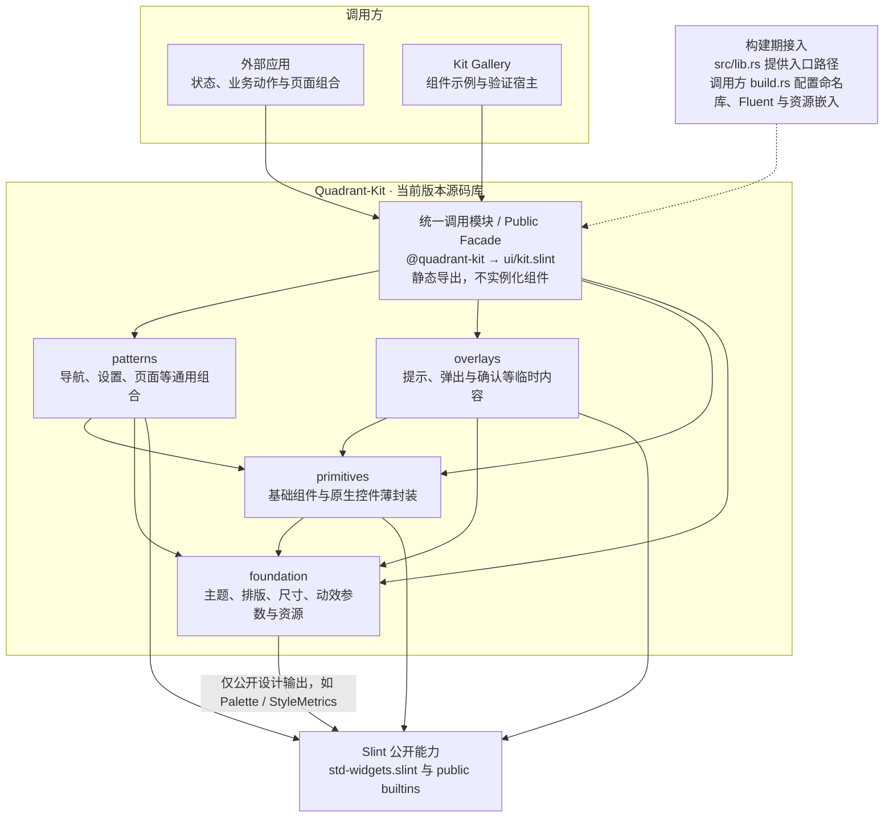

# Quadrant Kit

可复用的 Slint 源码组件库，附带用于开发与验证的 Gallery。当前版本 0.1.1 有
59 个公开名称、42 个视觉组件，通过 `v0.1.1` 保留源码。完整平台验收仍为 PARTIAL，
已知限制见 [当前状态](docs/STATUS.md)。构建本仓库不需要 Quadrant Tasks。

## 运行

开发工具链 Rust 1.94.1，声明的 MSRV 为 1.92，Slint / slint-build 固定为 1.17.1。

```console
cargo build --locked -p quadrant-kit-gallery
cargo run --locked -p quadrant-kit-gallery
```

Gallery 使用 Kit 的导航与控件；Settings 提供主题和预览宽度，示例可以展开源码。
Windows/macOS 窗口操作留在宿主层，组件库不引入事件循环、平台适配或业务状态。

## 架构与组件接入

应用通过 `@quadrant-kit` 导入 `ui/kit.slint` 的静态导出。根 Rust 包只提供构建期入口
路径，正常/runtime 依赖图为空。新增组件在所属层实现并从 facade 导出，不需要运行时注册。
patterns 与 overlays 不互相导入。Gallery catalog 只索引示例。

实线表示允许的导入/依赖，虚线表示构建期配置。Foundation 的 Slint 公开设计输出
连接是允许的能力边界，当前并未导入 Palette。图只在这里维护。



API 可以随版本调整，当前版本不保留旧实现或兼容层；旧接口由旧版本提供。
组件变更同步当前声明、快照、probe、示例与行为验证。

## 文档与验证

[在线文档](https://wadaxiyang.github.io/Quadrant-Kit/) ·
[API 参考](https://wadaxiyang.github.io/Quadrant-Kit/PUBLIC_API/)

- [文档导航](docs/README.md)：接入、API、Gallery、设计和验证入口。
- [验证命令](docs/VALIDATION.md)：编译、边界、运行时、打包与平台检查。
- [演进 SPEC](docs/specs/QUADRANT_KIT_FLUENT_EVOLUTION_SPEC.md)：范围、路线与验收。
- [版本记录](CHANGELOG.md)与[历史证据](docs/HISTORY.md)。

Code: GPL-3.0-only；Microsoft SVG: MIT。保留 [LICENSE](LICENSE)、
[THIRD-PARTY-NOTICES.md](THIRD-PARTY-NOTICES.md) 与
[图标许可](assets/icons/LICENSE-MIT)。来源见 [Provenance](docs/PROVENANCE.md)。
