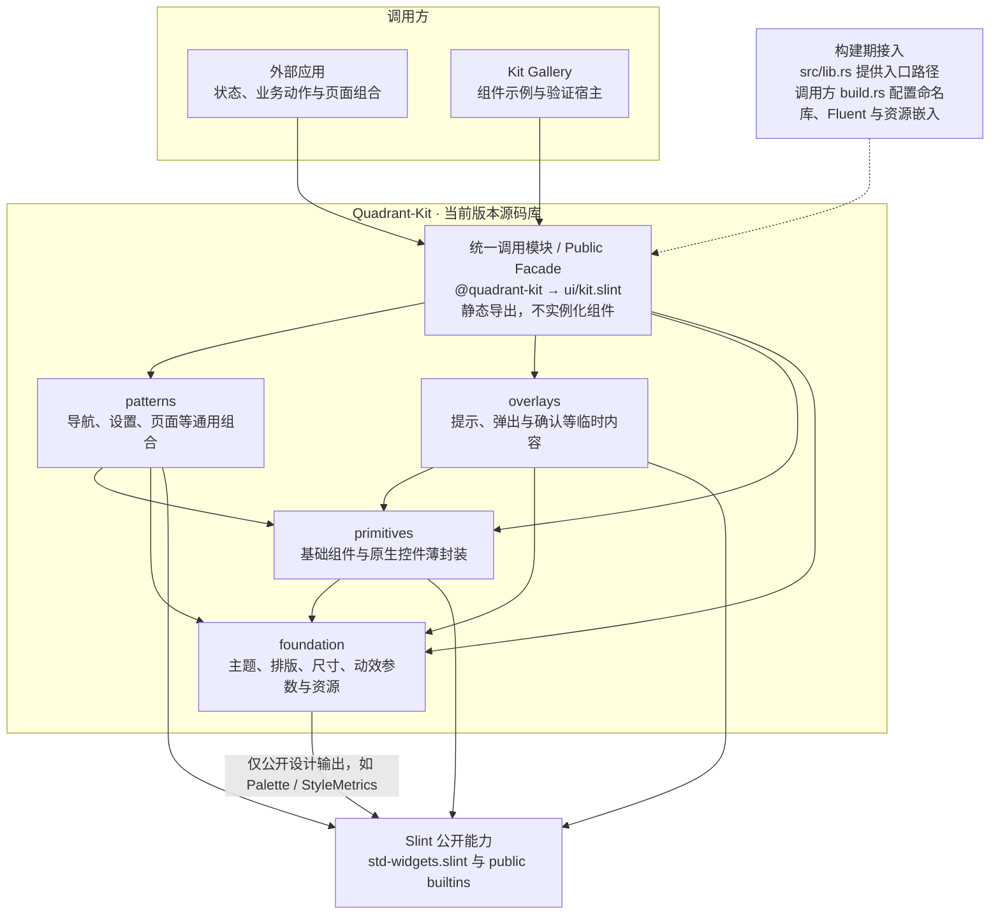

# Quadrant Kit

Reusable Fluent-oriented Slint source components, with a Gallery for development and learning. This is an independent Cargo workspace; Quadrant Tasks is not needed to build it.

Version **0.1.0 is an extraction candidate**. Candidate publication is separate from stable release and consumer adoption. Require same-SHA CI, a retained reference and actual remote-consumer evidence before adoption; see [validation](docs/VALIDATION.md). The source was extracted from Quadrant at `5a2262cd480d639673fa4f5dd406a9c7196361b5`; see [provenance](docs/PROVENANCE.md).

## 架构与组件接入

实线表示导入/依赖，虚线表示构建期配置。图描述允许的目标关系；
当前 foundation 尚未读取 Palette，新控件是否实现以组件状态表为准。



应用与 Gallery 通过 `@quadrant-kit` 使用当前版本组件。新增组件在所属实现层完成后，由 `ui/kit.slint` 静态导出，即可从统一入口导入使用；Gallery 的 catalog 仅负责展示与搜索，不参与 Kit 运行。内部实现不依赖调用方，patterns 与 overlays 不互相导入。API 可以随版本增删或调整，当前版本不提供旧实现与兼容层，需要旧接口时自行选择旧版本。

新增组件仍须完成实现、当前 API/快照/probe、原生复用清单及真实 Gallery 示例；
已接入的宿主无需新增运行时注册。现有组件增加属性时也不重复注册。
见 [组件状态](docs/COMPONENT_STATUS.md)、[原生复用](docs/NATIVE_REUSE.md)、
[阶段账本](docs/implementation/kit-fluent-v1/STATE.md)和[当前接入指南](docs/CONSUMER_GUIDE.md)。

## Run

With the existing pinned Rust 1.94.1 toolchain and native desktop build prerequisites:

```console
cargo build --locked -p quadrant-kit-gallery
cargo run --locked -p quadrant-kit-gallery
```

The declared minimum Rust version is 1.92; its build verification is tracked separately from the pinned development toolchain. Slint and slint-build stay at 1.17.1. Default Slint features, Fluent style, and runtime renderer selection are retained.

The root `quadrant-kit` package is only a build-time source locator. It owns no event loop, windows, persistence, platform integration, or Slint runtime dependency. Consumers compile the Slint source into their own application through the single `@quadrant-kit` facade.

## Explore

- [Architecture and component conventions](docs/ARCHITECTURE.md)
- [Public API and coverage](docs/PUBLIC_API.md)
- [Consumer setup](docs/CONSUMER_GUIDE.md)
- [Gallery, snapshots, and learning sequence](docs/GALLERY.md)
- [Source ownership and licenses](docs/PROVENANCE.md)
- [Candidate changes](CHANGELOG.md)
- [Checks, baseline review and platform evidence](docs/VALIDATION.md)

The current local facade exports 35 names, including NavigationView and the navigation
types, Back button, pane toggle and content surface. Gallery uses NavigationView
with a hierarchical catalog, title/keyword search and Gallery-owned Back history;
its 25 destinations share page scrolling and collapsible, selectable source/details.
Gallery shares one application toolbar and keeps platform-native window controls:
DWM caption buttons on Windows and AppKit traffic lights on macOS. The native
adapters compose these with the toolbar; Mac runtime verification is still pending.
See the [Gallery window notes](docs/GALLERY.md#native-window-chrome-and-shared-toolbar).
Home and All components use the same catalog as navigation/search, linking all 21
public visual components. Snapshot destinations are stable strings; 0–7 remain
explicit Gallery-only aliases.
The shell supports expanded/compact navigation, independent primary/footer
scrolling and keyboard focus recovery. Phase 7 records Windows input checks and
184 render scenes at simulated 100/125/150/200/225% scale; real monitor transitions
and full accessibility coverage remain unverified. Final local construction
checks are recorded in [the Phase 8 report](docs/NAVIGATION_REBUILD_PHASE8.md).
SidebarItem and its legacy tokens have been removed. These changes are unpublished; the retained
extraction source still has 28 names. Branding, task models, Inbox, task row
composition, quadrant colors, product-specific timer/layout tokens, and product
navigation aliases belong to Tasks. P2 migrates FluentButton to the public native Button, with reviewed API and visual changes documented in PUBLIC_API.md; other current components retain their scoped migration status.

Code is GPL-3.0-only; the Microsoft SVG assets retain their MIT license. See [LICENSE](LICENSE), [THIRD-PARTY-NOTICES.md](THIRD-PARTY-NOTICES.md), and [assets/icons/LICENSE-MIT](assets/icons/LICENSE-MIT).

## Validate

```console
cargo fmt --all --check
cargo clippy --workspace --all-targets --all-features --locked -- -D warnings
cargo test --workspace --locked
python scripts/check_ui_boundaries.py
python scripts/check_native_reuse.py
python -m unittest discover -s scripts/tests -p "test_*.py"
cargo build --locked -p quadrant-kit-gallery
python scripts/verify_distribution.py --package
cargo package --locked -p quadrant-kit --list
cargo package --locked -p quadrant-kit
python scripts/verify_distribution.py --package --archive target/package/quadrant-kit-0.1.0.crate
cargo +1.92.0 build --locked -p quadrant-kit -p quadrant-kit-gallery --target-dir target/msrv-1.92
```

Package/archive checks require a clean committed source snapshot. With exclusive
access to the checkout and build directory, also run
`python scripts/verify_incremental.py`; it temporarily changes and restores one
theme token and SVG. These local checks do not publish or retarget a consumer.

Python 3.11 or newer is required for developer checks, not for ordinary Slint consumers. The boundary command checks the current API snapshot, native reuse records, defaults, layer/import graph, assets, provenance, Cargo manifests and host-filtered resolved dependencies. CI never rewrites the baseline. See the validation record for the published source's actual CI/remote-consumer results and remaining native/a11y limits.

For a first exercise follow [the Badge walkthrough](docs/GALLERY.md#first-exercise-token-to-badge-to-gallery).
It needs only this checkout. The candidate retained at
`candidate/extraction-838ecfbead2d` has passed publication/consumer verification;
read [the consumer guide](docs/CONSUMER_GUIDE.md) for the exact adopted source.
