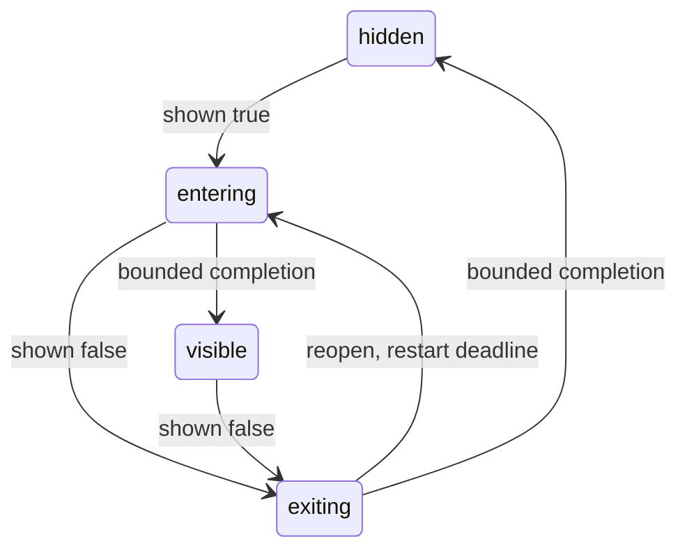

# Motion ownership and bounded presentation

Motion is per top-level Slint instance. The host sets animations_enabled (true by
default) and reduced_motion (false). With either disabling condition, effective
fast/standard/slow are 0 ms; otherwise 100/160/200 ms. Kit detects no OS preference,
creates no background observer and coordinates no independent windows.

## Current inventory

| Owner | Trigger / properties | Timing | Policy / cancellation |
|---|---|---|---|
| Kit ToastHost | Host shown changes; whole toast opacity | Effective standard, 160 ms ease-out | Reversal starts from current opacity; zero duration/own hide settles immediately |
| Kit ModalManager | Host shown changes; fixed surface/scrim opacity | Effective standard, 160 ms ease-out | Native input available during entry; disabled immediately on logical close; rapid reopen refocuses action |
| Kit TransientLifetime (private) | Observed logical request and policy | One cleanup timer only while entering/exiting | Restart on reversal; stop at stable state; zero-duration cleanup needs no timer tick |
| Native Button family | Hover/pressed/checked/disabled text/background/border | Fluent Button hardcodes 150 ms | Includes Kit buttons, navigation rows, Expander header, picker/dropdown/split actions; Kit policy does not override |
| Native CheckBox / RadioGroup | Foreground, state border/check visuals | 150/200 ms | Native-owned, no Kit global override |
| Native ComboBox / SpinBox / Slider / Switch | Native state/hover/handle presentation | 150/200 ms as pinned Fluent implementation | Native-owned |
| Native ScrollView / lists / table | Scroll affordance size/opacity, header/cell state | 150 ms native transitions and native scrolling | Native-owned; no duplicate scrolling animation |
| Native ProgressIndicator / Spinner | Indeterminate operation | Native repeated tick/rotation | Existing running/indeterminate/own-visibility contract controls activity; Motion does not override native internals |
| Native Tooltip / PopupWindow / Menu / date-time popup | Native service show/close/placement/focus | Native service timing | Immediate native popup close is retained; no fake delayed close or shown mirror |
| Expander content / InfoBar / passive containers | Host-controlled conditional content | Immediate | No extra container entry effect; required Expander host conditional unloads children |
| Text editing and caret | Native focus/input/IME | Native-owned | Kit motion policy does not interfere with editing or accessibility |

Inventory is based on the pinned 1.17.1 public controls and read-only source review,
not imported/copied internal implementations. Native motion is not claimed to be
fully switchable. Palette/theme changes follow native painting and host state.

## Logical state versus presentation

shown stays host-owned. ToastHost and ModalManager expose only read-only presented
and animating diagnostics. Opacity does not own commands, selection or focus.

Effective duration zero goes directly to visible/hidden, cancels the pending timer
and replaces the animated target with a zero-duration value. Re-enabling policy
while already stable does not replay entry. Changes are observed through normal
Slint property notifications; hosts establish desired global policy before opening.

Toast keeps a fixed 56 px presentation during its bounded exit, then collapses
once. No per-frame height/layout animation, blur increase or looping decoration is
introduced. Its native close and automatic dismissal timer stop on logical close.
The transient helper does not emit dismissed, accepted or restore callbacks.

Modal initial native action focus is available during entry. On logical close its
native actions, focus scope and scrim input disable immediately; host restoration
is requested at that point. A retained exiting body cannot block the background.
Reopening that body re-applies initial native action focus. Zero duration follows
the same command and restoration protocol without relying on a timer.

An own-root visible=false forces immediate presentation cleanup. Ancestor visibility
is not a universal activity signal in Slint: hosts close/unload overlays before
retaining hidden pages. Expander still requires its explicit host conditional slot.
There is no general popup manager, arbitrary focus capture or animation service.

## Evidence boundaries

P6's runtime suite checks actual intermediate opacity pixels, entry/exit input,
reduced policy during transitions, deadline restart, 20 simultaneous rows and 100
open/close cycles. Release before/after runs use the same 1200x500 software-buffer
scene, 200 raw samples per 1/20 Toast count and at least 60 seconds controlled idle.
All raw samples and source identities remain under target and are summarized in
[the P6 report](implementation/kit-fluent-v1/P6.md). No working-set trimming or
accessibility removal is used. Software-buffer cost is not actual screen-present
latency; an unsupported rendering hook is recorded as NOT_RUN, never zero redraw.
Native reader behavior and physical monitor changes remain separate. Current P7 measurements and any unmet gates are recorded in [P7.md](implementation/kit-fluent-v1/P7.md). P6 does not certify a full ContentDialog or all-platform zero animation.
